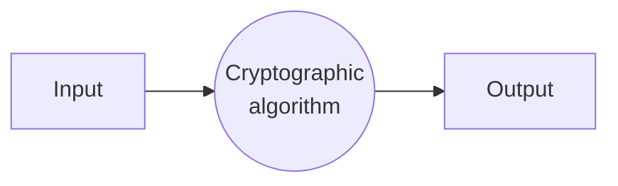
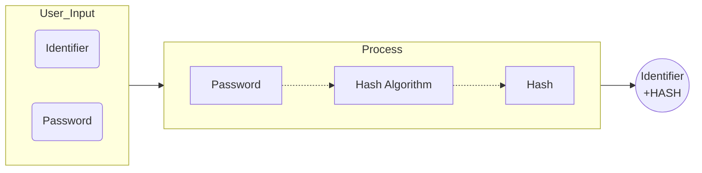
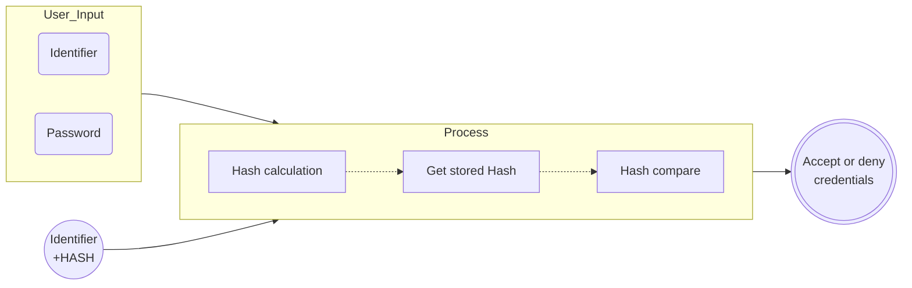
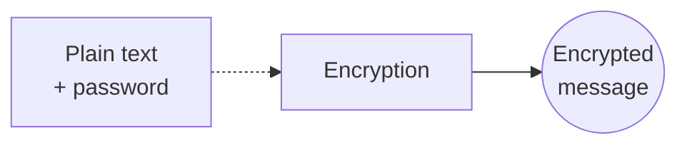
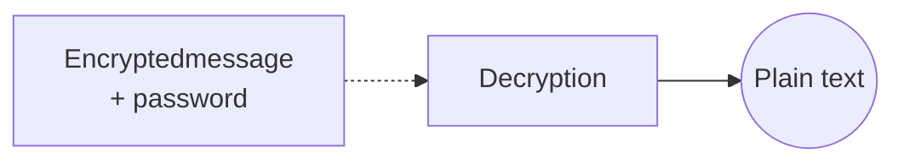

---
title: UD06: Cryptography
language: EN
author: David Martínez Peña [www.martinezpenya.es]
subject: Services and Processes coding
keywords: [PSP, 2022, coding, services, processes, multithread, Java]
IES: IES Eduardo Primo Marqués (Carlet) [www.ieseduardoprimo.es]
header: ${title} - ${subject} (ver. ${today}) 
footer:${currentFileName}.pdf - ${author} - ${IES} - ${pageNo}/${pageCount}
typora-root-url:${filename}/../
typora-copy-images-to:${filename}/../assets
imgcover:/media/DADES/NextCloud/DOCENCIA/PSP_2223/PSP-CFGS-2223/UD01/assets/cover.png
---
[toc]

# Introduction to cryptography

Security is one of the great challenges of computing in general and of programming in particular, especially in an environment of permanent Internet connectivity like the current one. Providing a secure environment requires multiple actions, since computer security is a task that must be approached from various perspectives.

The restriction of access, the custody of passwords or the storage and transmission of data are processes that must be equipped with mechanisms that provide security and integrity, both to the systems of which they are a part and to the information they manage.

This unit deals with different programming techniques capable of providing secure work environments in terms of software and data.

Cryptography is defined as a science, technique or art, depending on the approach, but in all cases reference is made to the transformation of an understandable message (clear) into one that cannot be understood (encrypted) except by the intended recipients. In cryptography as a discipline, computer science and mathematics coexist.

Since ancient times and throughout history, men have wanted to keep secrets for various reasons. Already the ancient Egyptians, approximately 2000 years before Christ, used an unconventional hieroglyphic system to write messages that could not be understood by the uninitiated. Much more famous and close in time, the so-called Caesar cipher was used by the Romans for the secure sending of military messages in the century BC. In the first half of the 20th century AD, during World War II, the ENIGMA machine was widely used by the German army for information exchange. This machine was key in the resolution of the military conflict, when a team of British mathematicians managed to find a way to decipher some of the messages,

These are just a few examples that illustrate the importance and age of cryptography, a discipline that, with the massive adoption of communication networks, has gained importance and global interest.

With the advent of computers and their enormous computing power, cryptographic systems have developed and become more sophisticated and secure, although also, and for the same reason, the mechanisms to decipher them are more powerful. Due to the latter, cryptographic systems, with the passage of time, can become unreliable. For example, the César encryption method in its time should have been absolutely secure while today its level of security is negligible. It is, therefore, necessary to review from time to time the security level of the cryptographic algorithms to know which one to use based on the current context.

Cryptographic systems may need to meet certain characteristics. The most important are the following:


- **Confidentiality**. Only authorized people or systems can access the information.
- **Integrity**. The information managed by the cryptographic system must remain intact, without suffering losses or alterations.
- **Authentication**. It must be possible to verify the identity of system participants.
- **Linking or non-repudiation**. It has mechanisms so that the creator or issuer of information cannot deny its link or authorship.

In some cryptographic systems, not all of these characteristics must be fulfilled simultaneously. In fact, there are systems that expressly require non-compliance with any of them to fulfill their objective.

In essence, all cryptographic processes work in the same way. An input (a message or a file, for example) is executed by a cryptographic algorithm and an output is produced.




As can be seen in this didactic unit, not all algorithms have the same mission or work in the same way. What they do agree on is that their objective is to provide a system with one or more characteristics of cryptographic systems.

# Cryptographic algorithms

Cryptographic algorithms are used in different processes, such as access control or the secure delivery of information. Depending on the objective of the cryptographic system, the type of algorithm to use is different. There are algorithms that allow a password to be "summarized" to prevent it from being obtained by non-legitimate methods and others that guarantee the identity of the participants in an information exchange.

In this unit, the main cryptographic algorithms are grouped by families, including their characteristics, strengths and weaknesses.

## HASH or digest algorithms

HASH or summary algorithms generate as output, as their name indicates, a "summary" of the input data. That is, the output is not equivalent in size or content to the input.

These algorithms must meet the following characteristics:

- Constant output size.
- Irreversible.
- Absence of collisions.

The size of the output is constant, independent of the size of the input, but dependent on the algorithm. Each digest algorithm generates a certain size. For example, SHA-256 generates digests of 32 bytes while those of MD5 are 16 bytes.

The transformation is irreversible. This means that given a digest you cannot get the entry that generated it. This feature is especially useful for the purpose of these algorithms.

The most robust HASH algorithms have no known collisions: no two different inputs will generate the same hash. In the simplest algorithms, collisions exist, albeit in a very low percentage, and some of them are known.

It is important to know that if the number of possible inputs is greater than the number of possible outputs it is inevitable that collisions can occur. The strength of such an algorithm lies in the fact that the possibility of a collision occurring is so remote that it is extremely unlikely to occur.

To illustrate how this type of algorithm works, three different input messages will be summarized with SHA-256, showing the output converted to hexadecimal format:


```yaml
Mensaje de entrada 1:
Sé lo que hicisteis el último verano
Resumen 1:
8f9bdlaefe928b388fdf54c6e4714953bc96cc7e199ca030affb820e830c7694
Mensaje de entrada 2:
El resplandor
Resumen 2:
c0c5e22c21e40c7972161d0910a92024d7f3190438ebd0d6658ce31c95e4cd3e
Mensaje de entrada 3:
El Resplandor
Resumen 3:
176dce7b4977d1c249636647ed97cb5f43b248bfafaf0c4d49911772e4ecd346
```

As can be seen, the size of the generated abstract is always the same, regardless of whether the input is two words or seven. Obviously, the summary generation process involves loss of information and this is a key aspect of these algorithms: they are not reversible. The input message cannot be obtained from the output message. This feature makes this type of algorithm ideal for password-based validation systems, as it stores the hash and not the password itself. This causes that, in the event of an information leak, even obtaining the encrypted passwords, the original passwords cannot be obtained, at least in a reasonable time.

On the other hand, it is observed that between input messages 2 and 3 the difference is only one letter converted to upper case. Despite this, the summary is completely different except in size.

HASH algorithms are primarily used to validate credentials and to ensure integrity.

The credential validation systems based on HASH algorithms have the following operation. When registering in a system, the user enters an identifier and a password. Using the HASH algorithm, a hash of the password is generated and stored together with the identifier. At this point, the storage has already been made safe, since, since it is not a reversible algorithm, if the shortened password is exposed, it will not be possible to obtain the original one.




Subsequently, to validate a user, the HASH algorithm will be applied to the password that is entered in the validation process and its summary will be compared with the one previously stored. Since these algorithms have no collision, if the hashes match it means that the passwords are identical. The advantage of this system is that at no time is the password stored or recovered in the clear, since you always work with the summary.




The most popular HASH algorithms are the following, although there are many more:

- MD5 (Message Digest Algorithm 5). Published in 1992, its use is currently not recommended due to HASH collisions being detected.
- SHA-1 (Secure Hash Algorithms 1). Published in 1995, its use is not recommended due to HASH collisions.
- SHA-2 (Secure Hash Algorithms 2). It is an evolution of SHA-1 and therefore more secure. It has many variants, the best known being SHA-256 and SHA-512 and the most secure (no HASH collisions detected) SHA-512/224 and SHA-512/256. The successive variants have been presented since 2004.
- SHA-3 (Secure Hash Algorithms 3). Although the similarity in the name is evident, this algorithm is not an evolution of SHA-1 or SHA-2, since they are technically different. It has many variants, named SHA-XXX and SHAKEXXX. Published in 2015.

Java provides at least the following HASH algorithms: MD5, SHA-1 and SHA-256, although depending on the Java implementation many more are available. For example, Java version 17 has "MD2", "MD", "SHA-1", "SHA-224", "SHA-256", "SHA-384", "SHA-512", "SHA -512/224”, “SHA-512/256”, “SHA3-224”, “SHA3-256”, “SHA3-384”, and “SHA3-512”.

> If a computer system or a website is able to recover the password in the clear, in case the user has forgotten it, it means that it is not using a HASH algorithm and therefore the system is insecure.


## Private key algorithms

Private key (also known as symmetric) algorithms are those that use a single key to encrypt and decrypt. These are the more traditional cryptographic algorithms and are used for secure storage of information.

This type of algorithm receives as input a clear message and a password, and generates an encrypted version of the message. Contrary to what happens with HASH algorithms, the encrypted message generated by private key algorithms has no loss of information: all the content of the original clear message is inside the encrypted message. The encrypted message, in turn, can be decrypted to obtain the original from the password used for its encryption.

> In cryptography, the algorithms are usually public, so security resides mainly in the password. A correct choice and management of passwords increases the security with which information is stored and transmitted.

These algorithms are very useful for storing information, but they present some inconveniences when using it in communications, since it requires that the participants in said communication have access to the same password, being the exchange and custody of this the vulnerable part of the process.






The main private key or symmetric algorithms are:

- **DES** (Data Encryption Standard). It was developed by IBM in the early 1970s and became the standard algorithm for symmetric encryption. Due to password size limitations and the increase in computing power of computers, this algorithm became vulnerable to brute force attacks, which is why it is currently considered an insecure algorithm.
- **IDEA**. Published in 1991 as an alternative to DES.
- **Blowfish**. It was created as an alternative to DES in 1993. It is a simple algorithm and considered safe.
- **RC5** (Rivest Cipher). Designed in 1994. This algorithm is part of the base of AES.
- **3DES**. Published in 1995, it is also known as 3DES. It is an evolution of the DES algorithm, since it performs a triple DES encryption on the messages, increasing security by being able to use longer keys. Although still considered secure, its use is not recommended and is being replaced by AES, a faster and more robust algorithm.
- **Twofish**. Introduced in 1998, it is derived from Blowfish and competed with AES as a candidate to replace DES as the standard. It is considered a safe algorithm.
- **AES** (Advanced Encryption Standard). Also known as Rijndael, it is probably the most popular symmetric cryptography algorithm today. It was developed in Belgium in 1998 and adopted as a standard in 2001. It is up to six times faster than DES and 3DES. It is currently the recommended private key algorithm.

Symmetric encryption algorithms are public, so any developer can create an encryption and decryption program. However, programming languages ​​usually include libraries dedicated to cryptography that include implementations of these algorithms.

In the case of the Java language, it includes an implementation of various variants of AES and 3DES (identified in Java as DESede).

## Public key algorithms

Public or asymmetric key cryptography is the most complex and complete, being especially useful for secure and reliable communications. The HTTPS protocol on the web, the electronic DNI or the digital signature are examples of the use of this type of algorithm.

In public key algorithms, each participant in the communication has two passwords: one public and one private. The public password is, as its name suggests, known and disseminated without restrictions: anyone has access to it. The private one, on the other hand, is kept secret. In a communication based on public key cryptography each participant has, in addition to his private and public passwords, all the public passwords of all the other participants.

As one might assume, the two keys in a pair are not independent of each other, but rather related. The relationships between the two keys of a participant are as follows:

- What is encrypted with the private key can only be decrypted with the public key.
- What is encrypted with the public key can only be decrypted with the private key.

Therefore, a message encrypted with a private key of a person or entity can only be decrypted with the public key of said person or entity, thus guaranteeing the identity of the sender (authentication) and non-repudiation, since only the owner of the private password was able to encrypt that message. Instead, it does not guarantee confidentiality, since anyone will have access to the public password.

In case of requiring confidentiality, the solution to this problem is simple. After the message is encrypted with the sender's private password, the result is encrypted again with the recipient's public password. In this way, only the recipient will be able to decrypt this second encryption with their private key (guaranteeing confidentiality) to subsequently decrypt the result with the issuer's public key (guaranteeing the issuer's identity and non-repudiation).

This double encryption and decryption is carried out when necessary, since sometimes it is not required to ensure any of the aforementioned characteristics.

The handicap in this cryptographic system consists in ensuring that the public keys of the participants in the communication are legitimate and have not been provided by a third party who is impersonating their identity. For this, what is called a "trusted third party" is used, which is an intermediary recognized by all parties as reliable and in charge of providing the public passwords of the participants in a communication.

On the web, this figure is represented by the issuers of digital certificates known as "certification bodies". In Spain, the Fábrica Nacional de Moneda y Timbre — Real Casa de la Moneda (FNMT-RCM) is an entity with authority for issuing digital certificates, based on public key algorithms.

The main public key encryption algorithms are:

- **RSA** (Rivest-Shamir-Adleman). Developed in 1977, it owes its name to the initials of the last names of its creators. It is the most widely used algorithm to encrypt information and perform digital signature.
- **DSA** (Digital Signature Algorithm). It is the standard algorithm of the United States Government to carry out digital signatures. This algorithm does not have the ability to encrypt information. It is slower than RSA.

# Programming of access control mechanisms

Virtually all business software systems and a large part of those used in the personal sphere store private and sensitive information inside. A company's business plans or a person's medical data, for example, are part of the type of information that should only be accessible to those who have the proper authorization. One of the first barriers to prevent this from happening is access control.

Access control is a mechanism that stands between users and the use of the application it protects.

Access control to software systems is usually carried out by validating authentication credentials (an identifier and a password associated with it), although there are other alternatives such as biometric controls, such as facial recognition, fingerprint recognition, etc. or voice.

Access control through the use of credentials has a very simple logic. The user has an identifier (his name, ID, employee number or email address, to name a few examples) and a password that only he knows. To access the corresponding software system, enter these credentials and the system verifies that they are correct before allowing access.

This well-implemented system is reliable and does the job, but it has a potential weakness: storing the password in the system for validation.

In security, we must start from the premise that all stored information, sooner or later, may be exposed. System administrators, software developers, or anyone with access to the computers that store a company's files and databases, can potentially consult the information they contain. Cybercriminals are, of course, included in this group of profiles, physically and technically capable of accessing information. Based on this fact, if passwords are stored without proper measures
security may be exposed to illegitimate access.

To avoid this risk, passwords are stored using HASH algorithms. These algorithms generate a summary of the input data (in this case the password), said summary having a fixed length and the impossibility of obtaining the original password from it.

The password storage and verification procedure using this type of algorithm is as follows:

- Registration process:
  - The user enters an identifier and password.
  - The HASH of the password is calculated.
  - The identifier and the HASH are stored.
- Verification process:
  - The user enters an identifier and password.
  - The HASH of the password is calculated.
  - The stored HASH associated with the entered identifier is obtained.
  - The calculated and stored HASH are compared. Due to the improbable existence of collisions (passwords that generate the same HASH) it can be affirmed that if the credentials and the HASH are the same, the credential entered is correct.

In this process, the password is never stored on any persistent medium, thus avoiding its exposure.

>If a software system provides the possibility of recovering the entered password, it means that it is storing it in the clear and that the system is not secure.

In Java, HASH generation can be performed using the algorithms included in the language version being used via the `MessageDigest` class, which takes care of providing the desired algorithm implementation via the `getinstance()` method. .

See [Example1](#Example1) to see how to list the available HASH methods, as well as an example for each of them.

In [Example2](#Example2) we have an application that manages access to a system by managing credentials (id and password).

# Programming safe storage methods

Symmetric or private key algorithms are used to encrypt information and later decrypt it. Unlike HASH algorithms, these algorithms allow you to recover the original information from the encrypted text, which makes them ideal for secure data storage. The **AES** symmetric key algorithm is one of the most widely used.

The AES algorithm, also known as Rijndael, follows a block cipher scheme. In this type of scheme, the input information is divided into blocks that are encrypted (or decrypted) later. **AES** has multiple variants that differ, among other things, in how they encrypt or decrypt the various blocks. This influences the security of the algorithm and its ability to perform encryption or decryption in parallel.

For example, the **ECB** (Electronic CodeBook) variant is the simplest, but not the most secure. The blocks are encrypted independently, so blocks containing the same information produce the same output, which means that the resulting result is less secure than other variants.

For its part, in the **CBC** (Cipher-Block Chaining) variant, each block participates in the encryption of the following block, so that the same blocks usually generate different outputs, making possible analysis difficult. Also, this variant requires an initialization vector (`IV`).

The main packages involved in the use of AES in Java are the following:

- `java.security` for key and random number management.
- `javax.crypto` for access to AES implementations.

The most commonly used interfaces and classes when using the AES algorithm in Java are those listed in the following table:

| Class or interface | Description |
| ---------------------------------------- | ------------------------------------------------------------ |
| `java.security.Key` | High level interface for all kinds of keys. |
| `java.security.NoSuchAlgorithmException` | The exception that is thrown when an attempt is made to instantiate an algorithm for which there is no implementation. |
| `java.security.SecureRandom` | This class provides a cryptographically strong random number. It is used to create an initialization vector. |
| `javax.crypto.spec.SecretKeySpec` | Specifies a secret key. It can be generated randomly or from a password known by the user. It implements the `java.security.Key` Interface. |
| `javax.crypto.Cipher` | Represents an implementation of an encryption algorithm. |

The most common methods used are shown below:

| Class | Method | Description |
| -------------- | ------------- | ------------------------------------------------------------ |
| `KeyGenerator` | `getInstance` | Provides a key generation algorithm. |
| `KeyGenerator` | `init` | Initializes the key generator to a given length in bits. |
| `KeyGenerator` | `generateKey` | Generate a key. |
| `SecureRandom` | `nextBytes` | Provides a random number of bytes. |
| `Cipher` | `getInstance` | Provides an implementation of an encryption and decryption algorithm. |
| `Cipher` | `init` | Initializes the encryption/decryption algorithm. |
| `Cipher` | `doEnd` | Encrypts or decrypts (depending on algorithm initialization) an array of bytes. |

Let's see an example of use in [Example3](#Example3)


# Programming of secure communication systems

Secure communication can be done using symmetric key algorithms, but this is usually not a good option. Both the sender and the receiver should have the same key and exchanging this can be a security weakness, as it could be exposed. In addition, this type of algorithms does not guarantee some of the characteristics normally required in secure communication.

Public key algorithms are a good alternative. The sender can encrypt the information to be sent with his private key and with the receiver's public key, thus guaranteeing all the characteristics that secure communication must have.

The RSA algorithm is the most popular. Java has implementations of this algorithm so its use is relatively simple.

The main packages that must be imported to use RSA in Java are the following:

- `java.security` for password management.
- `javax.crypto` to access the encryption and decryption algorithm.

The most commonly used interfaces and classes when using the RSA algorithm in Java are the following:

| Class or Interface | Description |
| ---------------------------------------- | ------------------------------------------------------------ |
| `java.security.Key` | High level interface for all kinds of keys. |
| `java.security.KeyFactory` | Key converter from byte format to Key format, and vice versa. |
| `java.security.KeyPair` | Represents a public and private key pair. |
| `java.security.KeyPairGenerator` | Public and private key pair generator. |
| `java.security.NoSuchAlgorithmException` | The exception that is thrown when an attempt is made to instantiate an algorithm for which there is no implementation. |
| `java.security.PrivateKey` | Represents a private key. |
| `java.security.PublicKey` | Represents a public key. |
| `java.security.spec.EncodedKeySpec` | Abstract class that represents an encrypted public or private key. |
| `java.security.spec.PKCS8EncodedKeySpec` | Represents a private key encoded with the PKCS#8 standard. Inherits from `EncodedKeySpec`. |
| `java.security.spec.X509EncodedKeySpec` | Represents a public key encoded with the X.509 standard. Inherits from `EncodedKeySpec`. |
| `javax.crypto.Cipher` | Represents an implementation of an encryption algorithm. |

And the most commonly used methods are:

| Class | Method | Description |
| ------------------ | ----------------- | ------------------------------------------------------------ |
| `KeyPairGenerator` | `getInstance` | Provides a key generation algorithm. |
| `KeyPairGenerator` | `initialize` | Sets the size of the keys. |
| `KeyPairGenerator` | `generateKeyPair` | Generates a private and public key pair. |
| `KeyFactory` | `getInstance` | Provides an instance of the key converter generator. |
| `KeyFactory` | `generatePublic` | Generates a `PublicKey` from an array of bytes. |
| `KeyFactory` | `generatePrivate` | Generates a `PrivateKey` from an array of bytes. |
| `SecureRandom` | `nextBytes` | Provides a random number of bytes. |
| `Cipher` | `getInstance` | Provides an implementation of an encryption and decryption algorithm. |
| `Cipher` | `init` | Initializes the encryption and decryption algorithm. |
| `Cipher` | `doEnd` | Encrypts or decrypts (depending on algorithm initialization) an array of bytes. |

Take a look at the [Example4](#Example4)


# Programming of the digital signature

The digital signature allows the sender's identity to be associated with a message, even if it is not encrypted, thus guaranteeing the origin of the message.

The digital signature process of a message or document is as follows:

- A HASH function is applied to the original message and a summary is obtained.
- The summary is encrypted with the issuer's private key, generating the digital signature. This signature therefore collects information about the message and the sender.
- The recipient receives the signature and the message. To confirm that the sender is who they say they are:
  - Decrypts the signature with the issuer's public key, obtaining the original HASH.
  - Calculate the HASH of the received message.
  - Compares the original HASH with the calculated HASH of the received message. If both are the same, it means that the message has not been modified and the sender is who he claims to be.
- Although the digital signature can be implemented with the digest and public key algorithms, Java has its own digital signature classes based on the DSA algorithm.

The class that implements the signature and its verification is java.security.Signature. The most relevant methods are shown below.

| Method | Description |
| ------------- | ------------------------------------------------------------ |
| `getInstance` | Static method that provides a digital signature algorithm. |
| `initSign` | Initializes the algorithm with a private key to generate a signature. |
| `update` | Add the data to sign to the algorithm. |
| `sign` | Generate the signature. |
| `initVerify` | Initializes the algorithm with a public key to verify a signature. |
| `verify` | Check if a signature is correct. |

Check the [Example5](#Example5)

# Secure communications protocols

In previous units, different forms of communication with different levels of abstraction are dealt with. The most important are two: communication through sockets and through the http protocol.

Both forms of communication are potentially insecure if standard protocols are used. Both information sent through a socket and through an HTTP call can be intercepted, leaving it exposed.

Fortunately, there are safe alternatives based on reliable encryption techniques.

In Java, when it comes to sockets, the javax.net.ssl ​​package provides different classes to implement secure sockets based on SSL (Secure Sockets Layer). The main classes of this package are the ones listed here:

| Class | Description |
| ------------------------ | ------------------------------------------------------------ |
| `SSLSocket` | Child class of `java.net.Socket` represents a secure socket. |
| `SSLServerSocket` | Child class of `java.net.ServerSocket` represents a secure server socket. |
| `SocketFactory` | Child class of `java.net.SocketFactory` allows you to create secure sockets. |
| `SSLServerSocketFactory` | Child class of `javax.net.ServerSocketFactory` allows you to create secure server sockets. |

For its part, secure communications based on the HTTP protocol must use the HTTPS protocol. Java provides the `javax.net.ssl.HttpsURLConnection` class, as a child class of `java.net.HttpURLConnection`, which incorporates features of the HTTPS protocol.

In order to use SSL-based communications, a digital certificate is required.

Obtaining a certificate recognized as valid must be provided by a certification authority (CA). Alternatively, a tool called keytoo! is provided with the Java JDK. that allows you to create a digital certificate from a terminal.

The syntax to create a digital certificate with keytool is the following:

```sh
keytool -genkeypair -alias certificate_name -keypass certificate_password validity validity -storepass store_password -keyalg algorithm
```

The parameters have the following meaning:

- `certificate_name`: the name of the certificate.
- `certificate_password`: the password of the certificate.
- `validity`: validity of the certificate in days.
- `store_password`: password of the store in which the certificate is going to be stored.
- `algorithm`: algorithm to use, it can be DSA or DES.

Once the command is entered, the tool requests a series of data before creating the certificate.

The following code corresponds to the creation of a certificate.

```sh
keytool -genkeypair -alias davidmp -keypass Psp@2023 -validity 100 -storepass Psp@2023 -keyalg "DSA"
```

The build process on a GNU/Linux system is similar to:


```sh
$ keytool -genkeypair -alias davidmp -keypass Psp@2023 -validity 100 -storepass Psp@2023 -keyalg "DSA"
What is your first and last name?
  [Unknown]:  David Martinez
What is the name of your organizational unit?
  [Unknown]:  Dep Informàtica
What is the name of your organization?
  [Unknown]:  IES Eduardo Primo
What is the name of your City or Locality?
  [Unknown]:  Carlet
What is the name of your State or Province?
  [Unknown]:  Valencia
What is the two-letter country code for this unit?
  [Unknown]:  ES
Is CN=David Martinez, OU=Dep Informàtica, O=IES Eduardo Primo, L=Carlet, ST=Valencia, C=ES correct?
  [no]:  yes

Generating 2.048 bit DSA key pair and self-signed certificate (SHA256withDSA) with a validity of 100 days
        for: CN=David Martinez, OU=Dep Informàtica, O=IES Eduardo Primo, L=Carlet, ST=Valencia, C=ES
```

The keystore is created as a file named `.keystore` in the user's home folder. The name and location of the file can be changed by adding the `-keystore` parameter.


```sh
$ ls -lsa .keystore 
4 -rw-rw-r-- 1 ubuntu ubuntu 2522 de gen.  26 18:12 .keystore
```

These certificates, although technically valid, will not be recognized as trustworthy, since they have not been issued by the entities authorized and accepted as trustworthy certificate issuers. However, they can be used to carry out secure communications between proprietary applications, since the public key exchange process is controlled.

If you want two SSL sockets to want to establish a connection with each other, you must create a certificate for each of them, export and import them crosswise (the client on the server, and vice versa) so that the two parties recognize each other as trusted .

To use the certificate, the Java applications that use it must be launched by indicating values ​​to the Java virtual machine (JVM) for the following parameters:


```sh
-Djavax.net.ssl.keyStore
-Djavax.net.ssl.keyStorePassword
-Djavax.net.ssl.trustStore
-Djavax.net.ssl.trustStorePassword
```

Java programs that make use of the certificates can also be configured by setting their location by calling the `setProperty` method of the `System` class.

Once the certificates have been generated and exchanged between client and server and after carrying out the corresponding configuration, socket programming must be done using the `SSLServerSocket` and `SSLSocket` classes in the same way that the `ServerSocket` and `Socket` classes are used. ` of those who inherit.

Look at [Example6](#Example6)

# Examples

## Example 1

This example shows the available HASH algorithms and computes the resume for a user-entered string. It must be taken into account that many of the characters generated in the summary are not printable but byte arrays, for the example they have been converted into hexadecimal with base 64.


```java
package UD06.Ejemplo1;

import java.math.BigInteger;
import java.nio.charset.StandardCharsets;
import java.security.MessageDigest;
import java.security.NoSuchAlgorithmException;
import java.security.Provider;
import java.security.Provider.Service;
import java.security.Security;
import java.util.Scanner;
import java.util.Set;
import java.util.logging.Level;
import java.util.logging.Logger;

public class Hash {

    public static void todosMetodos(String message) throws NoSuchAlgorithmException {
        System.out.format("ORIGINAL: %s%n", message);
        final String TIPO_MESSAGE_DIGEST = MessageDigest.class.getSimpleName();
        //Get the list of providers
        Provider[] proveedores = Security.getProviders();
        for (Provider proveedor : proveedores) {
            //For each provider, get services
            Set<Service> servicios = proveedor.getServices();
            for (Service servicio : servicios) {
                //and filter them by type
                if (servicio.getType().equals(TIPO_MESSAGE_DIGEST)) {
                    String hashName = servicio.getAlgorithm();
                    MessageDigest algorithm = MessageDigest.getInstance(hashName);
                    algorithm.reset();
                    algorithm.update(message.getBytes(StandardCharsets.UTF_8));
                    String hash = String.format("%064x", new BigInteger(1, algorithm.digest()));
                    System.out.format("%s: t%s%n", hashName, hash);
                }
            }
        }
    }

    public static void main(String[] args) {
        Scanner input = new Scanner (System.in);
        System.out.print("Introduce una cadena de texto sobre la que calcular el Hash: ");
        try {
            todosMetodos(input.nextLine());
        } catch (NoSuchAlgorithmException ex) {
            Logger.getLogger(Hash.class.getName()).log(Level.SEVERE, null, ex);
        }
        
    }
}
```

The output of the program will be similar to:


```
Introduce una cadena de texto sobre la que calcular el Hash: Programación de Servicios y procesos
ORIGINAL: Programación de Servicios y procesos
SHA-1: t000000000000000000000000eddc3201794572863de7fb98d4dea975e4868582
MD2: t000000000000000000000000000000003f775a958f410abbde94b962fb5b7e37
MD5: t00000000000000000000000000000000aaac2c6684af1804a7a341db8a1c05a3
SHA-512/256: t4fe8fcf52076a4668a0a1fcae001a957848434f3a836b92724b30e63f2409eb4
SHA3-512: t9b57c234e585e01cc2147ea97777fc0c85b98c7f0a4a300af7c44c8176b7f27ab2bdb05d2a0834a23a19c2c1074feaa56aa10a52ff2d8a8659633a0e710b6e93
SHA-256: t2d739407abb066442364b61de7dc3af838bf080b5c4d9f2eeef3d82c261fd174
SHA-384: t8d1c39d50c7ad1d53edb784f3f718dd8921e9c23f1b76ee854e976fc1bf8588245a6e79fd215c5d2f6ddf91570cf78a3
SHA-512/224: t00000000a51406cc6762e6b22bb813a8617b551b4e28c2eb50b241bc617fdb40
SHA-512: tb6c279635f3380fce0c1c848051c5be2ecccad058e1358cb18f686f6909f67b0e1c25abc21b26f44e7ab0d598a7eeef6753a605d0b0a6cb4456b3cb1b368c319
SHA3-256: t9df40ab1a16c192d6bbc7c05b63d97cfb0b7f5194ef3063145bdc35f3bd48e1b
SHA-224: t000000006dbce96f57601e7a1ab4f9d15ad30675383fd5177451715c937abadf
SHA3-384: t7533f075bb795770ec2b8f2aff70613272e87f14ccbac62d9c6bb0dae265e0420b7887ef2d7b44dc6468f7a923a7ee3e
SHA3-224: t00000000e70dce077e285b717123ce8d4b16443ade03b0b37c791c0ba73c8e7e
```

## Example2

The application is made up of three classes:

- `CredentialsRegister.java`. This class must be executed (it has a `main` method) to register the credentials. It requests the introduction of the user's identifier and password, generates the digest through the `getDigest` method of the `HASHManager` class, and stores it in a file.
- `CredentialValidator.java`. This class must be executed (it has a `main` method) to perform credential validation. It requests the introduction of the user's identifier and password, generates the digest through the `getDigest` method of the `HASHManager` class, retrieves the digest stored during registration and compares whether both digests (the one generated and the one retrieved from file) are equal via the `compareSummaries` method of the `HASHManager` class. Finally, it displays the two summaries converted to hexadecimal format using the `showHexSummary` method.
- `HASHManager.java`. Class in charge of operations related to summaries. It provides the following methods:
  - `getDigest`. Gets the summary of the given byte block. It uses the HASH algorithm indicated in the ALGORITHM constant.
  - `compareSummaries`. Compares two byte arrays (summaries) indicating whether or not they are equal.


**HASHManager.java**

```java
package UD06.Ejemplo2;

import java.security.MessageDigest;
import java.security.NoSuchAlgorithmException;

public class HASHManager {

    private static final String ALGORITHM = "SHA-256";

    public static byte[] getDigest(byte[] message) throws NoSuchAlgorithmException {
        byte[] hash = null;
        try {
            MessageDigest algorithm = MessageDigest.getInstance(ALGORITHM);
            algorithm.reset();
            algorithm.update(message);
            hash = algorithm.digest();
        } catch (NoSuchAlgorithmException e) {
            throw e;
        }
        return hash;
    }

    public static boolean compareHash(byte[] hash1, byte[] hash2) throws NoSuchAlgorithmException {
        boolean equals;
        try {
            MessageDigest algorithm = MessageDigest.getInstance(ALGORITHM);
            algorithm.reset();
            equals = algorithm.isEqual(hash1, hash2);
        } catch (NoSuchAlgorithmException e) {
            throw e;
        }
        return equals;
    }
}
```

**CredentialsRegister.java**

```java
package UD06.Ejemplo2;

import java.io.File;
import java.nio.file.Files;
import java.util.Scanner;

public class CredentialsRegister {

    private static final String ENCODING_TYPE = "UTF-8";

    public static void main(String[] args) {
        Scanner sc = new Scanner(System.in);
        System.out.print("Introduce your identifier (email): ");
        String identifier = sc.nextLine();
        System.out.print("Introduce your password: ");
        String password = sc.nextLine();
        try {
            byte[] hash = HASHManager.getDigest(password.getBytes(ENCODING_TYPE));
            Files.write(new File(identifier + ".credential").toPath(), hash);
        } catch (Exception e) {
            e.printStackTrace();
        }
        sc.close();
    }

}
```

**CredentialsValidator.java**

```java
package UD06.Ejemplo2;

import java.io.File;
import java.io.IOException;
import java.math.BigInteger;
import java.nio.file.Files;
import java.security.NoSuchAlgorithmException;
import java.util.Scanner;

public class CredentialsValidator {

    private static final String ENCODING_TYPE = "UTF-8";

    public static void main(String[] args) {
        Scanner sc = new Scanner(System.in);
        System.out.print("Introduce your identifier (email): ");
        String identifier = sc.nextLine();
        System.out.print("Introduce your password: ");
        String password = sc.nextLine();
        try {
            byte[] hash = HASHManager.getDigest(password.getBytes(ENCODING_TYPE));
            byte[] storedHash = Files.readAllBytes(new File(identifier + ".credential").toPath());
            if (HASHManager.compareHash(hash, storedHash)) {
                System.out.println("Authorized");
            } else {
                System.out.println("Wrong validation.");
            }
            showHexadecimalHash(hash);
            showHexadecimalHash(storedHash);

        } catch (NoSuchAlgorithmException e) {
            e.printStackTrace();
        } catch (IOException e) {
            e.printStackTrace();
        }
        sc.close();
    }

    private static void showHexadecimalHash(byte[] hash) {
        System.out.println(String.format("%064x", new BigInteger(1, hash)));
    }
}
```

## Example3

**Encryption and decryption in Java with AES algorithm**

This encryption application performs the following operations:

- Encrypt a text and store it in a file.
- Read a file with an encrypted text and decrypt it.

The AES/ECB algorithm is used. Although it is not the most secure variant, it is the easiest to use, since it does not require an initialization vector.

The generated system consists of three classes:

- `AESSimpleManager`. It implements the functionality related to the generation of the key from the user's password (must be 16 bytes) and the encryption and decryption methods. Contains the following methods:
  - `getKey`. Generates the encryption and decryption key from the user's password.
  - `encrypt`. Encrypts a String.
  - `decipher`. Decrypt a String.
- `CipherAESSimple`. It contains a `main` method that generates the key, encrypts a text and stores it in a file.
- `DecipherAESSimple`. It contains a `main` method that generates the key, reads the contents of a file, and decrypts it.


**AESSimpleManager.java**

```java
import java.security.Key;
import java.util.Base64;
import javax.crypto.Cipher;
import javax.crypto.spec.SecretKeySpec;

public class AESSimpleManager {

    public static Key getKey(String password, int longitud) {
        //The length of the key could be 16, 24 or 32 bytes.
        Key key = new SecretKeySpec(password.getBytes(), 0, longitud, "AES");
        return key;
    }

    public static String cipher(String clearText, Key key) throws Exception {
        Cipher cipher = Cipher.getInstance("AES/ECB/PKCS5Padding");
        cipher.init(Cipher.ENCRYPT_MODE, key);
        byte[] cipherText = cipher.doFinal(clearText.getBytes());
        return Base64.getEncoder().encodeToString(cipherText);
    }

    public static String decipher(String cipheredText, Key key) throws Exception {
        Cipher cipher = Cipher.getInstance("AES/ECB/PKCS5Padding");
        cipher.init(Cipher.DECRYPT_MODE, key);
        byte[] plainText = cipher.doFinal(Base64.getDecoder().decode(cipheredText));
        return new String(plainText);
    }
}
```

**CipherAESSimple.java**

```java
import java.io.PrintWriter;
import java.security.Key;

public class CipherAESSimple {

    public static void main(String[] args) {
        final int BLOCK_LENGTH = 16;//Expressed in bytes
        final String FILE_NAME = "ciphered_message.txt";
        final String PASSWORD = "MyNameIsDavidMar"; //AES only supports 16, 24 o 32 length keys.
        final String PLAIN_TEXT = "The secret number is 54321";
        try (PrintWriter pw = new PrintWriter(FILE_NAME);){
            Key key = AESSimpleManager.getKey(PASSWORD, BLOCK_LENGTH);
            String clearText = PLAIN_TEXT;
            String cipheredText = AESSimpleManager.cipher(clearText, key);
            pw.write(cipheredText);
            System.out.println("The message is ciphered correctly");
        } catch (Exception e) {
            e.printStackTrace();
        }
    }
}
```

**DecipherAESSimple.java**

```java
import java.io.BufferedReader;
import java.io.File;
import java.io.FileReader;
import java.security.Key;

public class DecipherAESSimple {

    public static void main(String[] args) {
        final int BLOCK_LENGTH = 16; //Expresado en bytes
        final String FILENAME = "ciphered_message.txt";
        final String PASSWORD = "MyNameIsDavidMar";
        File file = new File(FILENAME);
        try (BufferedReader br = new BufferedReader(new FileReader(file));) {
            Key key = AESSimpleManager.getKey(PASSWORD, BLOCK_LENGTH);
            String cipheredText = br.readLine();
            String plainText = AESSimpleManager.decipher(cipheredText, key);
            System.out.println("Deciphered text is: "+ plainText);
        } catch (Exception e) {
            e.printStackTrace();
        }
    }
}
```

## Example4

**Encryption and decryption in Java with the RSA algorithm**

This encryption application performs the following operations:

- Generate the public and private keys of a user.
- Encrypt a text with the user's public key and store it in a file.
- Read a file with an encrypted text and decrypt it with the user's private key.

The RSA algorithm is used.

Keep in mind that this activity only encrypts once with the issuer's private key, so anyone with access to the public key will be able to decrypt it.

In this way, the only thing that is guaranteed is the identity of the issuer, but not confidentiality.

On the other hand, it is also important to remember that the encrypted information is being stored in a file, but it could be being sent through some communication channel. The encryption and decryption process would be the same.

The generated system consists of three classes:

`KeysManager.java`: Generates the user's public and private keys and stores them. This class must be executed first and only once.

`RSASender.java`: Encrypts a text with the private key obtained from the file generated in `KeysManager.java` and stores the result in a file. This class must be executed second.

`RSAReceptor.java`: Decrypts the message stored in a file by `RSASender.java` with the public key obtained from the file generated in `KeysManager.java`. Show the message clearly on the console. This class should be executed last.

**KeysManager.java**

```java
import java.io.File;
import java.io.FileOutputStream;
import java.nio.file.Files;
import java.security.KeyFactory;
import java.security.KeyPair;
import java.security.KeyPairGenerator;
import java.security.NoSuchAlgorithmException;
import java.security.PrivateKey;
import java.security.PublicKey;
import java.security.spec.EncodedKeySpec;
import java.security.spec.X509EncodedKeySpec;
import java.security.spec.PKCS8EncodedKeySpec;

public class KeysManager {

    private static final String FICHERO_CLAVE_PUBLICA = "public.key";
    private static final String FICHERO_CLAVE_PRIVADA = "private.key";

    public static KeyPair generarClaves() throws NoSuchAlgorithmException {
        KeyPairGenerator generador = KeyPairGenerator.getInstance("RSA");
        generador.initialize(2048);
        KeyPair claves = generador.generateKeyPair();
        return claves;
    }

    public static void guardarClaves(KeyPair claves) throws Exception {
        FileOutputStream fos = new FileOutputStream(FICHERO_CLAVE_PUBLICA);
        fos.write(claves.getPublic().getEncoded());
        fos.close();
        fos = new FileOutputStream(FICHERO_CLAVE_PRIVADA);
        fos.write(claves.getPrivate().getEncoded());
        fos.close();
    }

    public static PublicKey getClavePublica() throws Exception {
        File ficheroClavePublica = new File(FICHERO_CLAVE_PUBLICA);
        byte[] bytesClavePublica = Files.readAllBytes(ficheroClavePublica.toPath());
        KeyFactory keyFactory = KeyFactory.getInstance("RSA");
        EncodedKeySpec publicKeySpec = new X509EncodedKeySpec(bytesClavePublica);
        PublicKey clavePublica = keyFactory.generatePublic(publicKeySpec);
        return clavePublica;
    }

    public static PrivateKey getClavePrivada() throws Exception {
        File ficheroClavePrivada = new File(FICHERO_CLAVE_PRIVADA);
        byte[] bytesClavePrivada = Files.readAllBytes(ficheroClavePrivada.toPath());
        KeyFactory keyFactory = KeyFactory.getInstance("RSA");
        EncodedKeySpec publicKeySpec = new PKCS8EncodedKeySpec(bytesClavePrivada);
        PrivateKey clavePrivada = keyFactory.generatePrivate(publicKeySpec);
        return clavePrivada;
    }

    public static void main(String[] args) {
        try {
            KeyPair claves = generarClaves();
            guardarClaves(claves);
        } catch (Exception e) {
            e.printStackTrace();
        }
    }
}
```

**RSAReceiver.java**

```java
import java.io.File;
import java.nio.charset.StandardCharsets;
import java.nio.file.Files;
import java.security.Key;
import java.security.PrivateKey;
import java.security.PublicKey;
import javax.crypto.Cipher;

public class RSAReceiver {

    private final static String DATOS = "Secret access code is 2294";

    private static byte[] decipher(byte[] cipheredMessage, Key key) throws Exception {
        Cipher decipherer = Cipher.getInstance("RSA");
        decipherer.init(Cipher.DECRYPT_MODE, key);
        byte[] decipheredMessage = decipherer.doFinal(cipheredMessage);
        return decipheredMessage;
    }

    public static void main(String[] args) {
        PublicKey publicKey;
        File file = new File("ciphereddata.rsa");
        try {
            publicKey = KeysManager.getClavePublica();
            byte[] cipheredMessage = Files.readAllBytes(file.toPath());
            byte[] decipheredMessage = decipher(cipheredMessage, publicKey);
            System.out.println(new String(decipheredMessage, StandardCharsets.UTF_8));
            Files.write(file.toPath(), cipheredMessage);
        } catch (Exception e) {
            e.printStackTrace();
        }
    }
}
```

**RSASender.java**

```java
import java.io.File;
import java.nio.charset.StandardCharsets;
import java.nio.file.Files;
import java.security.Key;
import java.security.PrivateKey;
import javax.crypto.Cipher;

public class RSASender {

    private final static String DATOS = "Secret access code is 2294";

    private static byte[] cipher(String message, Key key) throws Exception {
        Cipher encryptCipher = Cipher.getInstance("RSA");
        encryptCipher.init(Cipher.ENCRYPT_MODE, key);
        byte[] messageBytes = message.getBytes(StandardCharsets.UTF_8);
        byte[] cipheredMessageBytes = encryptCipher.doFinal(messageBytes);
        return cipheredMessageBytes;
    }

    public static void main(String[] args) {
        PrivateKey privateKey;
        File file = new File("ciphereddata.rsa");
        try {
            privateKey = KeysManager.getClavePrivada();
            byte[] cipheredMessage = cipher(DATOS, privateKey);
            Files.write(file.toPath(), cipheredMessage);
        } catch (Exception e) {
            e.printStackTrace();
        }
    }
}
```

## Example5

Integrity check with digital signature

The following application digitally signs a text and verifies through the digital signature that it has not been modified.

The application consists of two files, `KeysManager.java` and `DigitalSignature.java`, both executable from their `main` method.

`KeysManager.java` The execution of this class generates the pair of public and private keys for the DSA algorithm (specific for digital signatures) and stores them in separate files. It only needs to be run once.

`DigitalSignature.java`: This class is responsible for generating the signature and verifying it. It uses the private and public keys generated with `KeysManager.java`. In the code, the original message and the modified message have differences, so the signature verification result will be negative due to lack of integrity.


**KeysManager.java**

```java
import java.io.File;
import java.io.FileOutputStream;
import java.nio.file.Files;
import java.security.KeyFactory;
import java.security.KeyPair;
import java.security.KeyPairGenerator;
import java.security.NoSuchAlgorithmException;
import java.security.PrivateKey;
import java.security.PublicKey;
import java.security.spec.EncodedKeySpec;
import java.security.spec.X509EncodedKeySpec;
import java.security.spec.PKCS8EncodedKeySpec;

public class KeysManager {

    private static final String PUBLIC_KEY_FILE = "public.key";
    private static final String PRIVATE_KEY_FILE = "private.key";

    public static KeyPair generateKeys() throws NoSuchAlgorithmException {
        KeyPairGenerator generator = KeyPairGenerator.getInstance("DSA");
        generator.initialize(512);
        KeyPair keys = generator.generateKeyPair();
        return keys;
    }

    public static void storeKeys(KeyPair keys) throws Exception {
        FileOutputStream fos = new FileOutputStream(PUBLIC_KEY_FILE);
        fos.write(keys.getPublic().getEncoded());
        fos.close();
        fos = new FileOutputStream(PRIVATE_KEY_FILE);
        fos.write(keys.getPrivate().getEncoded());
        fos.close();
    }

    public static PublicKey getPublicKey() throws Exception {
        File publicKeyFile = new File(PUBLIC_KEY_FILE);
        byte[] bytesPublicKey = Files.readAllBytes(publicKeyFile.toPath());
        KeyFactory keyFactory = KeyFactory.getInstance("DSA");
        EncodedKeySpec publicKeySpec = new X509EncodedKeySpec(bytesPublicKey);
        PublicKey publicKey = keyFactory.generatePublic(publicKeySpec);
        return publicKey;
    }

    public static PrivateKey getPrivateKey() throws Exception {
        File ficheroClavePrivada = new File(PRIVATE_KEY_FILE);
        byte[] bytesClavePrivada = Files.readAllBytes(ficheroClavePrivada.toPath());
        KeyFactory keyFactory = KeyFactory.getInstance("DSA");
        EncodedKeySpec publicKeySpec = new PKCS8EncodedKeySpec(bytesClavePrivada);
        PrivateKey clavePrivada = keyFactory.generatePrivate(publicKeySpec);
        return clavePrivada;
    }

    public static void main(String[] args) {
        try {
            KeyPair claves = generateKeys();
            storeKeys(claves);
        } catch (Exception e) {
            e.printStackTrace();
        }
    }
}
```

**DigitalSignature.java**

```java
import java.security.InvalidKeyException;
import java.security.NoSuchAlgorithmException;
import java.security.Signature;

public class DigitalSignature {

    private static String MENSAJE_ORIGINAL = "El número premiado es el 23";
    private static String MENSAJE_MODIFICADO = "El número premiado es el 32";

    public static void main(String[] args) {
        try {
            Signature signature = Signature.getInstance("DSA");
            signature.initSign(KeysManager.getPrivateKey());
            signature.update(MENSAJE_ORIGINAL.getBytes());
            byte[] firma = signature.sign();
            signature.initVerify(KeysManager.getPublicKey());
            signature.update(MENSAJE_MODIFICADO.getBytes());
            if (signature.verify(firma)) {
                System.out.println("Mensaje verificado");
            } else {
                System.err.println("Atención: el mensaje no es fiable");
            }
        } catch (NoSuchAlgorithmException e) {
            e.printStackTrace();
        } catch (InvalidKeyException e) {
            e.printStackTrace();
        } catch (Exception e) {
            e.printStackTrace();
        }
    }
}
```

## Example6

Below is an example of a server using SSL secure protocol.

Remember that in order to test it correctly, you need to generate a keystore. The simplest is to use a self-signed certificate generated automatically with the Keytool.


```sh
keytool -genkeypair -alias "srvAlias" -keyalg RSA -keystore ServerKeyStore.jks -keysize 2048
```

When generating a certificate for a service, it is usually recommended that the Common Name (CN) field of its distinguished name be the DNS name of the machine on which it runs. If you try everything local, you can put `localhost`.

In this case, to set the information regarding the keystore, we have chosen to use calls to `System.setProperty()`. The store is in the same folder as the application project and is called `ServerKeyStore.jks`. The password for the store and its login with the server key is `serverks`.


**SSLServer.java**

```java
import java.util.Scanner;
import javax.net.ssl.SSLServerSocket;
import javax.net.ssl.SSLServerSocketFactory;
import javax.net.ssl.SSLSocket;

public class SSLServer {

    public static void main(String[] argv) throws Exception {
        System.setProperty("javax.net.ssl.keyStore", "ServerKeyStore.jks");
        System.setProperty("javax.net.ssl.keyStorePassword", "serverks");
        try {
            SSLServerSocketFactory sslFactory = (SSLServerSocketFactory) SSLServerSocketFactory.getDefault();
            SSLServerSocket srvSocket = (SSLServerSocket) sslFactory.createServerSocket(4043);
            System.out.println("Server initialized, waiting for client...");
            int numClient = 1;
            while (true) {
                SSLSocket cliSocket = (SSLSocket) srvSocket.accept();
                Scanner reader = new Scanner(cliSocket.getInputStream());
                String text = reader.nextLine();
                while (!text.equals("<<END>>")) {
                    System.out.println("[Client " + numClient + "] " + text);
                    System.out.flush();
                    text = reader.nextLine();
                }
                System.out.println("[Client " + numClient + "] Closing connection...");
                cliSocket.close();
                numClient++;
            }
        } catch (Exception ex) {
            System.out.println("Communication error: " + ex);
        }
    }
}
```

Specifically, this service attends to clients one by one, in a non-concurrent way. It successively assigns an identifier to each one and displays the data it receives from it on the screen. The `<<END>>` string is used to indicate that the client has finished and can therefore close the connection and serve the next one.

As with a server, the client also needs to be configured in advance. In this case, what needs to be specified is the list of digital certificate issuers that you trust. In this way, only the creation of a connection to a service that is considered reliable will be accepted. If a service identifies itself through SSL using a certificate that the client does not trust, the negotiation will fail and no connection will be established.

Trusted issuer certificates must be stored in a special Java keystore, called a truststore. It only contains entries with the certificates of the certification authorities, or self-signed certificates, that we trust. The client will only be able to connect to services that have been configured with a certificate issued by one of the entities included in the truststore.

As was the case with the service, to indicate all the information coming from this key store, it is necessary to use system properties. The `javax.net.ssl.trustStore` property indicates the path of the file, while `javax.net.ssl.trustStorePassword` indicates its password. Again, you can choose to use the `-D` flag per order line, or do it via code.

The following example shows a client capable of communicating with the above service. To make it work, you first need to properly configure your truststore. You'll need to export the self-signed certificate from the service's keystore and import it into the client's truststore. This can be done with the appropriate Keytool commands.

To export the certificate from the server store, it is necessary to do:


```sh
keytool -export -keystore ServerKeyStore.jks -alias "srvAlias" -file server.crt
```

  A partir del archivo resultante con el certificado, para importarlo se podría usar el siguiente comando. Si el almacén de claves no existe, lo creará:

```sh
keytool -importcert -file server.crt -keystore ClientTrustStore.jks -alias "srvAlias"
```

Si desea asegurarse de que el contenido de un almacén de confianza es correcto, se puede usar el comando:

```sh
keytool -list -v -keystore ClientTrustStore.jks
```

In the final code, the system properties associated with the truststore are set with calls. The truststore is considered to be in the `ClientTrustStore.jks` file, protected with the password `clientts`.


**SSLClient.java**

```java
package UD06.Ejemplo6;

import java.io.PrintStream;
import java.util.Scanner;
import javax.net.ssl.SSLSocket;
import javax.net.ssl.SSLSocketFactory;

public class SSLClient {

    public static void main(String[] argv) throws Exception {
        System.setProperty("javax.net.ssl.trustStore", "ClientTrustStore.jks");
        System.setProperty("javax.net.ssl.trustStorePassword", "clientts");
        try {
            SSLSocketFactory sslFactory = (SSLSocketFactory) SSLSocketFactory.getDefault();
            SSLSocket cliSocket = (SSLSocket) sslFactory.createSocket("localhost", 4043);
            Scanner reader = new Scanner(System.in);
            PrintStream writer = new PrintStream(cliSocket.getOutputStream());
            System.out.println("Send empty line (ENTER) to end:");
            String text = reader.nextLine();
            while (!text.equals("")) {
                writer.println(text);
                writer.flush();
                text = reader.nextLine();
            }
            writer.println("<<END>>");
            writer.flush();
            cliSocket.close();
        } catch (Exception ex) {
            System.out.println("Communication error: " + ex);
        }
    }
}
```

This client simply reads data from the keyboard and sends it to the server in text format, just as it has read it. If at any time only the ENTER key is pressed, leaving the line blank, it ends. Before, however, an orderly disconnection is carried out by sending the text `<<END>>`, which serves to notify the service that the client has terminated.

When testing clients and services with SSL, it can often happen that there is something wrong with the SSL negotiation and it is not visible to the naked eye. For cases like this, there is a system property called `javax.net.debug` that allows you to trigger debugging. The value to assign for it is:


```sh
System.setProperty("javax.net.debug", "SSL,handshake");
```

# Information sources

- [Wikipedia](https://en.wikipedia.org)
- [Programación de servicios y procesos - FERNANDO PANIAGUA MARTÍN [Paraninfo]](https://www.paraninfo.es/catalogo/9788413665269/programacion-de-servicios-y-procesos)
- [Programación de Servicios y Procesos - ALBERTO SÁNCHEZ CAMPOS [Ra-ma]](https://www.ra-ma.es/libro/programacion-de-servicios-y-procesos-grado-superior_49240/)
- [Programación de Servicios y Procesos - Mª JESÚS RAMOS MARTÍN - [Garceta] (1ª y 2ª Edición)](https://www.garceta.es)
- [Programación de servicios y procesos - CARLOS ALBERTO CORTIJO BON [Sintesis]](https://www.sintesis.com/desarrollo%20de%20aplicaciones%20multiplataforma-341/programaci%C3%B3n%20de%20servicios%20y%20procesos-ebook-2910.html)
- [Programació de serveis i processos - JOAR ARNEDO MORENO, JOSEP CAÑELLAS BORNAS i JOSÉ ANTONIO LEO MEGÍAS [IOC]](https://ioc.xtec.cat/materials/FP/Recursos/fp_dam_m09_/web/fp_dam_m09_htmlindex/index.html)
- GitHub repositories:
  - https://github.com/ajcpro/psp
  - https://oscarmaestre.github.io/servicios/index.html
  - https://github.com/juanro49/DAM/tree/master/DAM2/PSP
  - https://github.com/pablohs1986/dam_psp2021
  - https://github.com/Perju/DAM
  - https://github.com/eldiegoch/DAM
  - https://github.com/eldiegoch/2dam-psp-public
  - https://github.com/franlu/DAM-PSP
  - https://github.com/ProgProcesosYServicios
  - https://github.com/joseluisgs
  - https://github.com/oscarnovillo/dam2_2122
  - https://github.com/PacoPortillo/DAM_PSP_Tarea02_La-Cena-de-los-Filosofos

