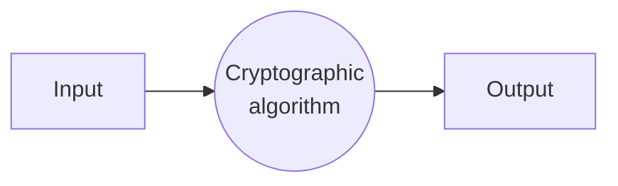
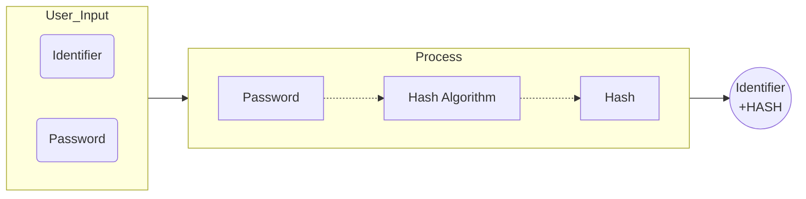
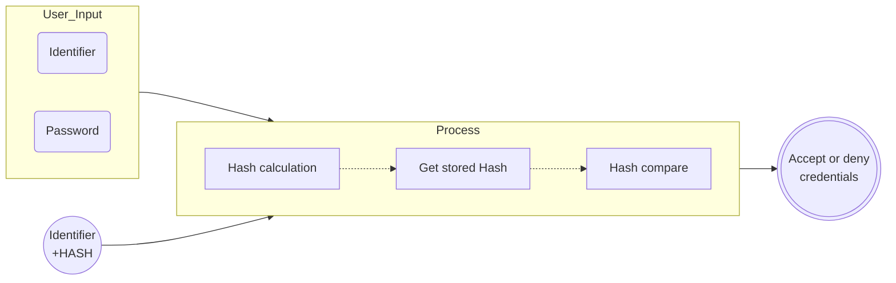
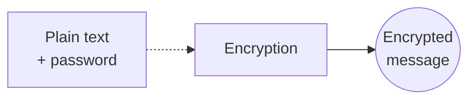
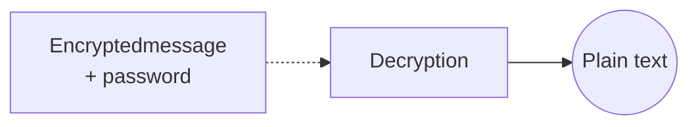

---
title: UD05: Criptografia
language: ES
author: David Martínez Peña [www.martinezpenya.es]
subject: Programación de Servicios y Procesos
keywords: [PSP, 2022, Programacion, servicios, procesos, multihilo, Java]
IES: IES Eduardo Primo Marqués (Carlet) [www.ieseduardoprimo.es]
header: ${title} - ${subject} (ver. ${today}) 
footer:${currentFileName}.pdf - ${author} - ${IES} - ${pageNo}/${pageCount}
typora-root-url:${filename}/../
typora-copy-images-to:${filename}/../assets
imgcover:/media/DADES/NextCloud/DOCENCIA/PSP_2223/PSP-CFGS-2223/UD01/assets/cover.png
---
[toc]

# Introducción a la criptografia

La seguridad es uno de los grandes desafíos de la informática en general y de la programación en particular, especialmente en un entorno de permanente conectividad a internet como el actual. Proporcionar un entorno seguro requiere múltiples acciones, ya que la seguridad informática es una tarea que hay que abordar desde varios enfoques. 

La restricción de acceso, la custodia de contraseñas o el almacenamiento y la transmisión de datos son procesos que deben estar dotados de mecanismos que proporcionen seguridad e integridad, tanto a los sistemas de los que forman parte como a la información que gestionan.

En esta unidad se abordan diferentes técnicas de programación capaces de proporcionar entornos de trabajo seguros en lo que al software y los datos se refiere.

La criptografía se define como ciencia, técnica o arte, dependiendo del enfoque, pero en todos los casos se hace referencia a la transformación de un mensaje comprensible (en claro) en uno que no puede ser entendido (cifrado) salvo por los destinatarios deseados. En la criptografía como disciplina conviven las ciencias de la computación y las matemáticas.

Desde muy antiguo y a lo largo de la historia, los hombres han querido mantener secretos por diversas razones. Ya los antiguos egipcios, aproximadamente 2000 años antes de Cristo, utilizaban un sistema de jeroglíficos no convencional para escribir mensajes que no pudiesen ser comprendidos por los no iniciados. Mucho más célebre y próximo en el tiempo, el conocido como cifrado César fue utilizado por los romanos para el envío seguro de mensajes militares en el siglo ¡ antes de Cristo. En la primera mitad del siglo xx de nuestra era, durante la Segunda Guerra Mundial, la máquina ENIGMA fue utilizada ampliamente por el ejército alemán para el intercambio de información. Esta máquina fue clave en la resolución del conflicto militar, cuando un equipo de matemáticos británicos logró encontrar la manera de descifrar algunos de los mensajes, concediendo una importante ventaja a las tropas aliadas al poder anticipar los movimientos del enemigo. 

Estos son solo algunos ejemplos que ilustran la trascendencia y la antigúedad de la criptografía, una disciplina que, con la adopción masiva de las redes de comunicaciones, ha adquirido importancia e interés global. 

Con la llegada de los ordenadores y su enorme potencia de cálculo, los sistemas criptográficos se han ido desarrollando y haciendo más sofisticados y seguros, aunque también y por la misma razón, los mecanismos para descifrarlos son más potentes. Debido a esto último, los sistemas criptográficos, con el paso del tiempo, pueden dejar de ser fiables. Por ejemplo, el método César de cifrado en su época debió ser absolutamente seguro mientras que en la actualidad su nivel de seguridad es ínfimo. Es, por lo tanto, necesario revisar cada cierto tiempo el nivel de seguridad de los algoritmos criptográficos para saber cuál utilizar en función del contexto vigente.

Los sistemas criptográficos pueden necesitar cumplir ciertas características. Las más importantes son las siguientes:

- **Confidencialidad**. Solo pueden tener acceso a la información las personas o sistemas autorizados.
- **Integridad**. La información gestionada por el sistema criptográfico debe permanecer íntegra, sin sufrir pérdidas ni alteraciones.
- **Autenticación**. Se debe poder verificar la identidad de los participantes del sistema.
- **Vinculación o no repudio**. Dispone de mecanismos para que el creador o emisor de una información no pueda negar su vínculo o autoría.

En algunos sistemas criptográficos no todas estas características se deben cumplir simultáneamente. De hecho, existen sistemas que requieren expresamente el incumplimiento de alguna de ellas para cumplir su objetivo.

En esencia, todos los procesos criptográficos funcionan de la misma manera. A una entrada (un mensaje o un fichero, por ejemplo) se le aplica la ejecución de un algoritmo criptográfico y se produce una salida.



Como se puede comprobar en esta unidad didáctica, no todos los algoritmos tienen la misma misión ni funcionan de la misma manera. En lo que sí coinciden es en que su objetivo es dotar a un sistema de una o más características de las propias de los sistemas criptográficos.

# Algoritmos criptográficos

Los algoritmos criptográficos se utilizan en procesos distintos, como el control de acceso o el envío seguro de información. Dependiendo del objetivo del sistema criptográfico, el tipo de algoritmo autilizar es diferente. Hay algoritmos que permiten «resumir» una contraseña para evitar que esta sea obtenida por métodos no legítimos y otros que garantizan la identidad de los participantes en un intercambio de información.

En esta unidad se exponen agrupados por familias los principales algoritmos criptográficos, incluyendo sus características, fortalezas y debilidades.

## Algoritmos HASH o de resumen

Los algoritmos HASH o de resumen generan como salida, tal y como indica su nombre, un «resumen» de los datos de entrada. Es decir, la salida no es equivalente ni en tamaño ni en contenido a la entrada.

Estos algoritmos deben cumplir las siguientes características:

- Tamaño de salida constante.
- Irreversible.
- Ausencia de colisiones.

El tamaño de la salida es constante, independiente del tamaño de la entrada, pero dependiente del algoritmo. Cada algoritmo de resumen genera un tamaño determinado. Por ejemplo, SHA-256 genera resúmenes de 32 bytes mientras que los de MD5 son de 16 bytes.

La transformación es irreversible. Esto significa que dado un resumen no se puede obtener la entrada que lo generó. Esta característica es especialmente útil para el propósito de estos algoritmos.

Los algoritmos HASH más robustos no tienen colisiones conocidas: no hay dos entradas distintas que generen el mismo resumen. En los algoritmos más sencillos las colisiones existen, aunque sea en un porcentaje muy bajo, y algunas de ellas son conocidas.

Es importante saber que si el número de posibles entradas es mayor que el número de posibles salidas es inevitable que las colisiones se puedan producir. La fortaleza de un algoritmo de este tipo reside en que la posibilidad de que ocurra una colisión sea tan remota que resulte extremadamente improbable que se produzca.

Para ilustrar el modo en que funciona este tipo de algoritmos, se van a resumir con SHA-256 tres mensajes de entrada distintos, mostrando la salida convertida a formato hexadecimal:

```yaml
Mensaje de entrada 1:
Sé lo que hicisteis el último verano
Resumen 1:
8f9bdlaefe928b388fdf54c6e4714953bc96cc7e199ca030affb820e830c7694
Mensaje de entrada 2:
El resplandor
Resumen 2:
c0c5e22c21e40c7972161d0910a92024d7f3190438ebd0d6658ce31c95e4cd3e
Mensaje de entrada 3:
El Resplandor
Resumen 3:
176dce7b4977d1c249636647ed97cb5f43b248bfafaf0c4d49911772e4ecd346
```

Como se puede observar, el tamaño del resumen generado siempre es el mismo, independientemente de que la entrada sean dos palabras o siete. Obviamente, el proceso de generación del resumen implica pérdida de información y este es un aspecto clave de estos algoritmos: no son reversibles. A partir del mensaje de salida no se puede obtener el mensaje de entrada. Esta característica convierte a este tipo de algoritmos en ideales para sistemas de validación basados en contraseñas, al almacenar el resumen y no la contraseña en sí. Esto provoca que, en caso de una filtración de información, aun obteniendo las contraseñas cifradas, no se podrán obtener las contraseñas originales, al menos en un tiempo razonable.

Por otra parte, se observa que entre los mensajes de entrada 2 y 3 la diferencia es únicamente una letra convertida a mayúsculas. A pesar de ello, el resumen es absoluta mente distinto salvo en el tamaño.

Los algoritmos HASH se utilizan fundamentalmente para validar credenciales y para garantizar la integridad.

Los sistemas de validación de credenciales basados en algoritmos HASH tienen el siguiente funcionamiento. Al registrarse en un sistema, el usuario introduce un identificador y una contraseña. Mediante el algoritmo HASH se genera un resumen de la contraseña y se almacena junto con el identificador. En este punto ya se ha conseguido que el almacenamiento sea seguro, ya que, al no ser un algoritmo reversible, si la contraseña resumida queda expuesta no será posible obtener la original.



Posteriormente, para validar a un usuario, se aplicará el algoritmo HASH a la contraseña que se introduzca en el proceso de validación y se comparará el resumen de esta con el almacenado anteriormente. Dado que estos algoritmos no tienen colisión, si los resúmenes coinciden significará que las contraseñas son idénticas. La ventaja de este sistema consiste en que en ningún momento la contraseña se almacena ni se recupera en claro, ya que siempre se trabaja con el resumen.



Los algoritmos HASH más populares son los siguientes, aunque existen muchos más:

- MD5 (Message-Digest Algorithm 5). Publicado en 1992, en la actualidad no se recomienda su uso por haberse detectado colisiones de HASH.
- Mi SHA-1 (Secure Hash Algorithms 1). Publicado en 1995, no se recomienda su uso por haberse detectado colisiones de HASH.
- Mi SHA-2 (Secure Hash Algorithms 2). Es una evolución de SHA-1 y, por lo tanto, más seguro. Tiene muchas variantes, siendo la más conocidas SHA-256 y SHA-512 y las más seguras (no se han detectado colisiones de HASH) SHA-512/224 y SHA-512/256. Las sucesivas variantes se han ido presentando desde el año 2004.
- SHA-3 (Secure Hash Algorithms 3). Aunque la similitud en el nombre es evidente, este algoritmo no es una evolución de SHA-1 ni de SHA-2, ya que técnicamente son distintos. Tiene muchas variantes, denominadas SHA-XXX y SHAKEXXX. Publicado en 2015.

Java proporciona, al menos, los siguientes algoritmos de HASH: MD5, SHA-1 y SHA-256, aunque dependiendo de la implementación de Java dispondrá de muchos más. Por ejemplo, la versión 17 de Java dispone de «MD2», «MD», «SHA-1», «SHA-224», «SHA-256», «SHA-384», «SHA-512», «SHA-512/224», «SHA-512/256», «SHA3-224», «SHA3-256», «SHA3-384» y «SHA3-512».

> Si un sistema informático o un sitio web es capaz de recuperar la contraseña en claro, en caso de que el usuario la haya olvidado, significará que no está utilizando un algoritmo HASH y que, por lo tanto, el sistema es inseguro.

## Algoritmos de clave privada

Los algoritmos de clave privada (también conocidos como simétricos) son los que utilizan una única clave para cifrar y descifrar. Estos son los algoritmos criptográficos más tradicionales y se utilizan para almacenamiento seguro de la información. 

Este tipo de algoritmos recibe como entrada un mensaje en claro y una contraseña, y genera una versión cifrada del mensaje. Al contrario que ocurre con los algoritmos HASH, el mensaje cifrado generado por los algoritmos de clave privada no tienen pérdida de información: todo el contenido del mensaje original en claro se encuentra dentro del mensaje cifrado. El mensaje cifrado, a su vez, se puede descifrar para obtener el original a partir de la contraseña utilizada para su cifrado.

> En criptografía, los algoritmos suelen ser públicos por lo que la seguridad reside principalmente en la contraseña. Una correcta elección y gestión de las contraseñas incrementa la seguridad con la que se almacena y transmite la información.

Estos algoritmos son muy útiles para almacenar información, pero presentan algunos inconvenientes para utilizarlo en comunicaciones, ya que requiere que los participantes de dicha comunicación tengan acceso a la misma contraseña, siendo el intercambio y custodia de esta la parte vulnerable del proceso.





Los principales algoritmos de clave privada o simétricos son:

- **DES** (Data Encryption Standard). Fue desarrollado por IBM a principios de los años 70 del siglo xx y se convirtió en el algoritmo estándar del cifrado simétrico. Debido a las limitaciones de tamaño de la contraseña y con el incremento de la capacidad de cálculo de los ordenadores, este algoritmo se convirtió en vulnerable a los ataques por fuerza bruta, por lo que en la actualidad se considera un algoritmo inseguro.
- **IDEA**. Publicado en 1991 como alternativa a DES. 
- **Blowfish**. Se creó como alternativa a DES en 1993. Es un algoritmo sencillo y considerado seguro.
- **RC5** (Rivest Cipher). Diseñado en 1994. Este algoritmo es parte de la base de AES. 
- Triple **DES**. Publicado en 1995, es conocido también como 3DES. Es una evolución del algoritmo DES, ya que realiza un triple cifrado DES sobre los mensajes, incrementando la seguridad al poder utilizar claves más largas. Aunque aún se considera seguro, no se recomienda su uso y está siendo sustituido por AES, un algoritmo más rápido y robusto.
- **Twofish**. Presentado en 1998, deriva de Blowfish y compitió con AES como candidato a sustituir a DES como estándar. Se considera un algoritmo seguro.
- **AES** (Advanced Encryption Standard). Conocido también como Rijndael, probablemente es el algoritmo de criptografía simétrica más popular en la actualidad. Fue desarrollado en Bélgica en 1998 y adoptado como estándar en 2001. Es hasta seis veces más rápido que DES y 3DES. Actualmente es el algoritmo de clave privada recomendado.

Los algoritmos de cifrado simétrico son públicos, por lo que cualquier desarrollador puede crear un programa de cifrado y descifrado. No obstante, los lenguajes de programación suelen incluir librerías dedicadas ala criptografía que incluyen implementaciones de estos algoritmos.

En el caso de lenguaje Java, incluye una implementación de diversas variantes de AES y de 3DES (identificado en Java como DESede).

## Algoritmos de clave pública

La criptografía de clave pública o asimétrica es la más compleja y completa, siendo especialmente útil para realizar comunicaciones seguras y fiables. El protocolo HTTPS en la web, el DNI electrónico o la firma digital son ejemplos de utilización de este tipo de algoritmos.

En los algoritmos de clave pública cada participante de la comunicación dispone de dos contraseñas: una pública y una privada. La contraseña pública es, como su propio nombre indica, conocida y difundida sin restricciones: cualquiera tiene acceso a ella. La privada, en cambio, se mantiene en secreto. En una comunicación basada en criptografía de clave pública cada participante tiene, además de sus contraseñas privada y pública, todas las contraseñas públicas de todos los demás participantes.

Como se puede suponer, las dos claves de un par no son independientes entre sí, sino que están relacionadas. Las relaciones entre las dos claves de un participante son las siguientes:

- Aquello que se cifra con la clave privada solo se puede descifrar con la clave pública.
- Aquello que se cifra con la clave pública solo se debe descifrar con la clave privada.

Por lo tanto, un mensaje cifrado con una clave privada de una persona o entidad solo puede ser descifrado con la clave pública de dicha persona o entidad, garantizando así la identidad del emisor (autenticación) y el no repudio, ya que solo el propietario de la contraseña privada ha podido cifrar dicho mensaje. En cambio, no garantiza la confidencialidad, ya que cualquiera tendrá acceso a la contraseña pública. 

En caso de requerir confidencialidad, la solución a este problema es sencilla. Una vez cifrado el mensaje con la contraseña privada del emisor, el resultado se vuelve a cifrar con la contraseña pública del destinatario. De esta manera solo el destinatario podrá descifrar este segundo cifrado con su clave privada (garantizando la confidencialidad) para, posteriormente, descifrar el resultado con la clave pública del emisor (garantizando identidad del emisor y no repudio).

Este doble cifrado y descifrado se efectúa cuando es necesario, ya que en ocasiones no se requiere asegurar alguna de las características citadas.

El hándicap en este sistema criptográfico consiste en asegurar que las claves públicas de los participantes en la comunicación son legítimas y no han sido proporcionadas por un tercero que está suplantando su identidad. Para esto se utiliza lo que se denomina «tercero de confianza», que es un intermediario reconocido por todas las partes como fiable y encargado de proporcionar las contraseñas públicas de los participantes en una comunicación.

En la web, esta figura está representada por los emisores de certificados digitales conocidos como «organismos de certificación». En España, la Fábrica Nacional de Moneda y Timbre — Real Casa de la Moneda (FNMT-RCM) es una entidad con autoridad para la expedición de certificados digitales, basados en algoritmos de clave pública. 

Los principales algoritmos de cifrado de clave pública son:

- **RSA** (Rivest-Shamir-Adleman). Desarrollado en 1977, debe su nombre a las iniciales de los apellidos de sus creadores. Es el algoritmo más utilizado para cifrar información y realizar firma digital.
- **DSA** (Digital Signature Algorithm). Es el algoritmo estándar del Gobierno de Estados Unidos para realizar firmas digitales. Este algoritmo no tiene la capacidad de cifrar información. Es más lento que RSA.

# Programación de mecanismos de control de acceso

Prácticamente todos los sistemas software empresariales y una gran parte de los utilizados en el ámbito personal almacenan en su interior información privada y sensible. Los planes de negocio de una empresa o los datos médicos de una persona, por ejemplo, forman parte del tipo de información al que solo deben poder acceder aquellas personas que tienen la debida autorización. Una de las primeras barreras para impedir que esto ocurra es el control de acceso.

El control de acceso es un mecanismo que se interpone entre los usuarios y el uso de la aplicación a la que protege.

Habitualmente el control de acceso a los sistemas de software se realiza mediante la validación de credenciales de autenticación (un identificador y una contraseña asociada a este), aunque existen otras alternativas como pueden ser los controles por biometría, como el reconocimiento facial, de huella dactilar o de voz. 

El control de acceso mediante el uso de credenciales tiene una lógica muy sencilla. El usuario dispone de un identificador (su nombre, DNI, número de empleado o dirección de correo electrónico, por citar algunos ejemplos) y una contraseña que solo él conoce. Para acceder al sistema software correspondiente introduce dichas credenciales y el sistema verifica que son correctas antes de permitir el acceso.

Este sistema bien implementado es fiable y cumple con su función, pero tiene un potencial punto débil: el almacenamiento de la contraseña en el sistema para poder realizar la validación.

En seguridad hay que partir de la premisa de que toda la información almacenada, tarde o temprano, puede quedar expuesta. Los administradores de sistemas, los desarrolladores de software, o cualquier persona con acceso a los ordenadores que almacenan los ficheros y las bases de datos de una empresa, pueden potencialmente consultar la información que estos contienen. En este grupo de perfiles, física y técnicamente capaces de acceder a la información, se incluyen, por supuesto, los delincuentes cibernéticos. Partiendo de este hecho, si las contraseñas se almacenan sin las debidas medidas
de seguridad podrán quedar expuestas ante un acceso ilegítimo.

Para evitar este riesgo, las contraseñas se almacenan utilizando algoritmos HASH. Estos algoritmos generan un resumen de los datos de entrada (en este caso la contraseña), teniendo dicho resumen una longitud fija y la imposibilidad de obtener la contraseña original a partir del mismo.

El procedimiento de almacenamiento y verificación de contraseñas utilizando este tipo de algoritmos es el siguiente:

- Proceso de registro:
  - El usuario introduce identificador y contraseña.
  - Se calcula el HASH de la contraseña.
  - Se almacenan el identificador y el HASH.
- Proceso de verificación:
  - El usuario introduce identificador y contraseña.
  - Se calcula el HASH de la contraseña.
  - Se obtiene el HASH almacenado asociado al identificador introducido.
  - Se comparan el HASH calculado y el almacenado. Debido a la improbable existencia de colisiones (contraseñas que generan el mismo HASH) se puede afirmar que si las credenciales y los HASH son iguales la credencial introducida es correcta.

En este proceso la contraseña jamás se almacena en ningún soporte persistente, con lo que se evita la exposición de esta.

>Si un sistema software proporciona la posibilidad de recuperar la contraseña introducida significa que la está almacenando en claro y que el sistema no es seguro.

En Java, la generación de HASH se puede realizar mediante los algoritmos incluidos en la versión del lenguaje que se está utilizando a través de la clase `MessageDigest`, que se encarga de proporcionar la implementación del algoritmo deseado mediante el método `getinstance()`.

Consulta el [Ejemplo1](#Ejemplo1) para ver como listar los métodos HASH disponibles, así como un ejemplo para cada uno de ellos.

En el [Ejemplo2](#Ejemplo2) tenemos una aplicación que gestiona el acceso a un sistema mediante la gestión de credenciales (id y password).

# Programación de métodos de almacenamiento seguro

Los algoritmos de clave simétrica o privada se utilizan para cifrar la información y, posteriormente, descifrarla. Al contrario que los algoritmos HASH, estos algoritmos permiten recuperar la información original a partir del texto cifrado, lo que los convierte en idóneos para el almacenamiento seguro de datos. El algoritmo de clave simétrica **AES** es uno de los más utilizados.

El algoritmo AES, también conocido como Rijndael, sigue un esquema de cifrado por bloques. En este tipo de esquema, la información de entrada se divide en bloques que son cifrados (o descifrados) posteriormente. **AES** tiene múltiples variantes que se diferencian, entre otras cosas, en cómo cifran o descifran los distintos bloques. Esto influye en la seguridad del algoritmo y en la capacidad que tiene para realizar el cifrado o descifrado en paralelo.

Por ejemplo, la variante **ECB** (Electronic CodeBook) es la más sencilla, pero no la más segura. Los bloques se cifran de manera independiente, por lo que los bloques que contengan la misma información generan la misma salida, lo que significa que el resultado obtenido es menos seguro que otras variantes. 

Por su parte, en la variante **CBC** (Cipher-Block Chaining) cada bloque participa en el cifrado del bloque siguiente, por lo que bloques iguales suelen generan salidas diferentes, dificultando el posible análisis. Además, esta variante necesita de un vector de inicialización (`IV`).

Los principales paquetes que participan en el uso de AES en Java son los siguientes:

- `java.security` para la gestión de claves y de números aleatorios.
- `javax.crypto` para el acceso a las implementaciones de AES.

Las interfaces y clases usadas más habitualmente al utilizar el algoritmo AES en Java son las que se recogen en la siguiente tabla:

| Clase o interface                        | Descripción                                                  |
| ---------------------------------------- | ------------------------------------------------------------ |
| `java.security.Key`                      | Interfaz de alto nivel para todo tipo de claves.             |
| `java.security.NoSuchAlgorithmException` | Excepción que se produce cuando se intenta instanciar un algoritmo del que no hay implementación. |
| `java.security.SecureRandom`             | Esta clase proporciona un número aleatorio criptográficamente fuerte. Se utiliza para crear un vector de inicialización. |
| `javax.crypto.spec.SecretKeySpec`        | Especifica una clave secreta. Puede ser generada aleatoriamente o a partir de una contraseña conocida por el usuario. Implementa la Interface `java.security.Key`. |
| `javax.crypto.Cipher`                    | Representa una implementación de un algoritmo de cifrado.    |

Los métodos utilizados más comunes se muestran a continuación:

| Clase          | Método        | Descripción                                                  |
| -------------- | ------------- | ------------------------------------------------------------ |
| `KeyGenerator` | `getInstance` | Proporciona un algoritmo de generación de claves.            |
| `KeyGenerator` | `init`        | Inicializa el generador de claves a una longitud determinada en bits. |
| `KeyGenerator` | `generateKey` | Genera una clave.                                            |
| `SecureRandom` | `nextBytes`   | Proporciona un número aleatorio de bytes.                    |
| `Cipher`       | `getInstance` | Proporciona una implementación de un algoritmo de cifrado y descifrado. |
| `Cipher`       | `init`        | Inicializa el algoritmo de cifrado/descifrado.               |
| `Cipher`       | `doFinal`     | Cifra o descifra (según la inicialización del algoritmo) un conjunto de bytes. |

Veamos el un ejemplo de uso en el [Ejemplo3](#Ejemplo3)

# Programación de sistemasde comunicación segura

La comunicación segura se puede realizar utilizando algoritmos de clave simétrica, pero esto no suele ser una buena opción. Tanto el emisor como el receptor deberían tener la misma clave y el intercambio de esta puede ser un punto débil en lo referente a la seguridad, ya que podría quedar expuesta. Además, este tipo de algoritmos no garantiza algunas de las características necesarias habitualmente en una comunicación segura.

Los algoritmos de clave pública son una buena alternativa. El emisor puede cifrar la información a enviar con su clave privada y con la clave pública del receptor, garantizando así todas las características que debe tener una comunicación segura. 

El algoritmo RSA es el más popular. Java dispone de implementaciones de este algoritmo por lo que su uso es relativamente sencillo.

Los principales paquetes que se deben importar para utilizar RSA en Java son los siguientes:

- `java.security` para la gestión de las claves.
- `javax.crypto` para acceder al algoritmo de cifrado y descifrado.

Las interfaces y clases usadas más habitualmente al utilizar el algoritmo RSA en Java son las que se recogen a continuación:

| Clase o Interfaz                         | Descripción                                                  |
| ---------------------------------------- | ------------------------------------------------------------ |
| `java.security.Key`                      | Interfaz de alto nivel para todo tipo de claves.             |
| `java.security.KeyFactory`               | Conversor de claves de formato byte a formato Key, y viceversa. |
| `java.security.KeyPair`                  | Representa un par de claves pública y privada.               |
| `java.security.KeyPairGenerator`         | Generador de pares de clave públicay privada.                |
| `java.security.NoSuchAlgorithmException` | Excepción que se produce cuando se intenta instanciar un algoritmo del que no hay implementación. |
| `java.security.PrivateKey`               | Representa una clave privada.                                |
| `java.security.PublicKey`                | Representa una clave pública.                                |
| `java.security.spec.EncodedKeySpec`      | Clase abstracta que representa una clave pública o privada codificada. |
| `java.security.spec.PKCS8EncodedKeySpec` | Representa una clave privada codificada con el estándar PKCS#8. Hereda de `EncodedKeySpec`. |
| `java.security.spec.X509EncodedKeySpec`  | Representa una clave pública codificada con el estándar X.509. Hereda de `EncodedKeySpec`. |
| `javax.crypto.Cipher`                    | Representa una implementación de un algoritmo de cifrado.    |

Y los métodos más comunmente utilizados son:

| Clase              | Método            | Descripción                                                  |
| ------------------ | ----------------- | ------------------------------------------------------------ |
| `KeyPairGenerator` | `getInstance`     | Proporciona un algoritmo de generación de claves.            |
| `KeyPairGenerator` | `initialize`      | Establece el tamaño de las claves.                           |
| `KeyPairGenerator` | `generateKeyPair` | Genera un par de claves privada y pública.                   |
| `KeyFactory`       | `getInstance`     | Proporciona una instancia del generador de conversor de claves. |
| `KeyFactory`       | `generatePublic`  | Genera una `PublicKey` a partir de un conjunto de bytes.     |
| `KeyFactory`       | `generatePrivate` | Genera una `PrivateKey` a partir de un conjunto de bytes.    |
| `SecureRandom`     | `nextBytes`       | Proporciona un número aleatorio de bytes.                    |
| `Cipher`           | `getInstance`     | Proporciona una implementación de un algoritmo de cifrado y descifrado. |
| `Cipher`           | `init`            | Inicializa el algoritmo de cifrado y descifrado.             |
| `Cipher`           | `doFinal`         | Cifra o descifra (según la inicialización del algoritmo) un conjunto de bytes. |

Consulta el [Ejemplo4](#Ejemplo4)

#  Programación de la firma digital

La firma digital permite asociar la identidad del emisor a un mensaje, aunque este no esté cifrado, garantizando así el origen del mensaje.

El proceso de firma digital de un mensaje o documento es el siguiente:

- Al mensaje original se le aplica una función HASH y se obtiene un resumen.
- El resumen se cifra con la clave privada del emisor, generando la firma digital. Esta firma recoge, por lo tanto, información del mensaje y del emisor.
- El destinatario recibe la firma y el mensaje. Para confirmar que el emisor es quien dice ser:
  - Descifra la firma con la clave pública del emisor, obteniendo el HASH original.
  - Calcula el HASH del mensaje recibido.
  - Compara el HASH original con el HASH calculado del mensaje recibido. Si ambos son iguales, significa que el mensaje no ha sufrido modificaciones y el emisor es quien dice ser.
- Aunque se puede implementar la firma digital con los algoritmos de resumen y de clave pública, Java dispone de sus propias clases de firma digital basadas en el algoritmo DSA.

La clase que implementa la firma y la comprobación de esta es java.security.Signature. A continuación se muestran los métodos más relevantes.

| Método        | Descripción                                                  |
| ------------- | ------------------------------------------------------------ |
| `getInstance` | Método estático que proporciona un algoritmo de firma digital. |
| `initSign`    | Inicializa el algoritmo con una clave privada para generar una firma. |
| `update`      | Añade los datos a firmar al algoritmo.                       |
| `sign`        | Genera la firma.                                             |
| `initVerify`  | Inicializa el algoritmo con una clave pública para verificar una firma. |
| `verify`      | Verifica si una firma es correcta.                           |

Revisa el [Ejemplo5](#Ejemplo5)

# Protocolos seguros de comunicaciones

En unidades anteriores se tratan diferentes formas de comunicación con distintos niveles de abstracción. Los más importantes son dos: la comunicación a través de sockets y mediante el protocolo http.

Ambas formas de comunicación son potencialmente inseguras si se usan los protocolos estándar. Tanto la información enviada a través de un socket como a través de una llamada HTTP puede ser interceptada, quedando expuesta. 

Afortunadamente, existen alternativas seguras basadas en técnicas fiables de cifrado.

En Java, en lo referente a los sockets, el paquete javax.net.ssl proporciona diferentes clases para implementar sockets seguros basados en SSL (Secure Sockets Layer). Las principales clases de este paquete son las que se recogen aquí:

| Clase                    | Descripción                                                  |
| ------------------------ | ------------------------------------------------------------ |
| `SSLSocket`              | Clase hija de `java.net.Socket` representa un socket seguro. |
| `SSLServerSocket`        | Clase hija de `java.net.ServerSocket` representa un socket servidor seguro. |
| `SocketFactory`          | Clase hija de `java.net.SocketFactory` permite crear sockets seguros. |
| `SSLServerSocketFactory` | Clase hija de `javax.net.ServerSocketFactory` permite crear sockets servidor seguros. |

Por su parte, las comunicaciones seguras basadas en el protocolo HTTP deben utilizar el protocolo HTTPS. Java proporciona la clase `javax.net.ssl.HttpsURLConnection`, como clase hija de `java.net.HttpURLConnection`, que incorpora características propias del protocolo HTTPS.

Para poder utilizar comunicaciones basadas en SSL se necesita un certificado digital.

La obtención de un certificado reconocido como válido debe ser proporcionado por parte de una autoridad de certificación (AC). Como alternativa, con el JDK de Java se proporciona una herramienta llamada keytoo! que permite crear un certificado digital desde un terminal.

La sintaxis para crear un certificado digital con keytool es la siguiente: 

```sh
keytool -genkeypair -alias nombre_certificado -keypass contraseña_certificado validity validez -storepass contraseña_almacen -keyalg algoritmo
```

Teniendo los parámetros el siguiente significado:

- `nombre_certificado`: el nombre del certificado.
- `contraseña_certificado`: la contraseña del certificado.
- `validez`: validez del certificado en días.
- `contraseña_almacen`: contraseña del almacén en el que se va a almacenar el certificado.
- `algoritmo`: algoritmo a utilizar, puede ser DSA o DES.

Una vez se introduce el comando, la herramienta solicita una serie de datos antes de crear el certificado.

El siguiente código se corresponde con la creación de un certificado.

```sh
keytool -genkeypair -alias davidmp -keypass Psp@2023 -validity 100 -storepass Psp@2023 -keyalg "DSA"
```

El proceso de creación en un sistema GNU/Linux es similar a:

```sh
$ keytool -genkeypair -alias davidmp -keypass Psp@2023 -validity 100 -storepass Psp@2023 -keyalg "DSA"
What is your first and last name?
  [Unknown]:  David Martinez
What is the name of your organizational unit?
  [Unknown]:  Dep Informàtica
What is the name of your organization?
  [Unknown]:  IES Eduardo Primo
What is the name of your City or Locality?
  [Unknown]:  Carlet
What is the name of your State or Province?
  [Unknown]:  Valencia
What is the two-letter country code for this unit?
  [Unknown]:  ES
Is CN=David Martinez, OU=Dep Informàtica, O=IES Eduardo Primo, L=Carlet, ST=Valencia, C=ES correct?
  [no]:  yes

Generating 2.048 bit DSA key pair and self-signed certificate (SHA256withDSA) with a validity of 100 days
        for: CN=David Martinez, OU=Dep Informàtica, O=IES Eduardo Primo, L=Carlet, ST=Valencia, C=ES
```

El almacén se crea como un fichero con el nombre `.keystore` en la carpeta home del usuario. El nombre y la ubicación del fichero se pueden modificar agregando el parámetro `-keystore`.

```sh
$ ls -lsa .keystore 
4 -rw-rw-r-- 1 ubuntu ubuntu 2522 de gen.  26 18:12 .keystore
```

Estos certificados, aunque técnicamente válidos, no serán reconocidos como confiables, ya que no han sido emitidos por las entidades autorizadas y aceptadas como emisoras de certificados de confianza. No obstante, se pueden utilizar para realizar comunicaciones seguras entre aplicaciones propias, pues el proceso de intercambio de claves públicas está controlado.

Si se desea que dos sockets SSL quieran establecer conexión entre sí, se debe crear un certificado para cada uno de ellos, exportarlos e importarlos de forma cruzada (el cliente en el servidor, y viceversa) para que las dos partes se reconozcan como de confianza. 

Para utilizar el certificado se deben lanzar las aplicaciones Java que los usen indicando a la máquina virtual de Java (JVM) valores para los parámetros siguientes: 

```sh
-Djavax.net.ssl.keyStore
-Djavax.net.ssl.keyStorePassword
-Djavax.net.ssl.trustStore
-Djavax.net.ssl.trustStorePassword
```

También se pueden configurar los programas Java que hacen uso de los certificados configurando su ubicación mediante llamadas al método `setProperty` de la clase `System`. 

Una vez generados e intercambiados los certificados entre cliente y servidor y tras realizar la correspondiente configuración, la programación de los sockets se debe realizar utilizando las clases `SSLServerSocket` y `SSLSocket` de igual manera que se utilizan las clases `ServerSocket` y `Socket` de las que heredan.

Observa el [Ejemplo6](#Ejemplo6)

# Ejemplos

## Ejemplo1

Este ejemplo muestra los algoritmos HASH disponibles y calcula el resume para una cadena de texto introducida por el usuario. Hay que tener en cuenta que muchos de los carácteres generados en el resumen no son imprimibles sino arrays de bytes, para el ejemplo se han convertido en hexadecimal con base 64.

```java
package UD06.Ejemplo1;

import java.math.BigInteger;
import java.nio.charset.StandardCharsets;
import java.security.MessageDigest;
import java.security.NoSuchAlgorithmException;
import java.security.Provider;
import java.security.Provider.Service;
import java.security.Security;
import java.util.Scanner;
import java.util.Set;
import java.util.logging.Level;
import java.util.logging.Logger;

public class Hash {

    public static void todosMetodos(String message) throws NoSuchAlgorithmException {
        System.out.format("ORIGINAL: %s%n", message);
        final String TIPO_MESSAGE_DIGEST = MessageDigest.class.getSimpleName();
        //Get the list of providers
        Provider[] proveedores = Security.getProviders();
        for (Provider proveedor : proveedores) {
            //For each provider, get services
            Set<Service> servicios = proveedor.getServices();
            for (Service servicio : servicios) {
                //and filter them by type
                if (servicio.getType().equals(TIPO_MESSAGE_DIGEST)) {
                    String hashName = servicio.getAlgorithm();
                    MessageDigest algorithm = MessageDigest.getInstance(hashName);
                    algorithm.reset();
                    algorithm.update(message.getBytes(StandardCharsets.UTF_8));
                    String hash = String.format("%064x", new BigInteger(1, algorithm.digest()));
                    System.out.format("%s: t%s%n", hashName, hash);
                }
            }
        }
    }

    public static void main(String[] args) {
        Scanner input = new Scanner (System.in);
        System.out.print("Introduce una cadena de texto sobre la que calcular el Hash: ");
        try {
            todosMetodos(input.nextLine());
        } catch (NoSuchAlgorithmException ex) {
            Logger.getLogger(Hash.class.getName()).log(Level.SEVERE, null, ex);
        }
        
    }
}
```

La salida del programa será parecida a:

```
Introduce una cadena de texto sobre la que calcular el Hash: Programación de Servicios y procesos
ORIGINAL: Programación de Servicios y procesos
SHA-1: t000000000000000000000000eddc3201794572863de7fb98d4dea975e4868582
MD2: t000000000000000000000000000000003f775a958f410abbde94b962fb5b7e37
MD5: t00000000000000000000000000000000aaac2c6684af1804a7a341db8a1c05a3
SHA-512/256: t4fe8fcf52076a4668a0a1fcae001a957848434f3a836b92724b30e63f2409eb4
SHA3-512: t9b57c234e585e01cc2147ea97777fc0c85b98c7f0a4a300af7c44c8176b7f27ab2bdb05d2a0834a23a19c2c1074feaa56aa10a52ff2d8a8659633a0e710b6e93
SHA-256: t2d739407abb066442364b61de7dc3af838bf080b5c4d9f2eeef3d82c261fd174
SHA-384: t8d1c39d50c7ad1d53edb784f3f718dd8921e9c23f1b76ee854e976fc1bf8588245a6e79fd215c5d2f6ddf91570cf78a3
SHA-512/224: t00000000a51406cc6762e6b22bb813a8617b551b4e28c2eb50b241bc617fdb40
SHA-512: tb6c279635f3380fce0c1c848051c5be2ecccad058e1358cb18f686f6909f67b0e1c25abc21b26f44e7ab0d598a7eeef6753a605d0b0a6cb4456b3cb1b368c319
SHA3-256: t9df40ab1a16c192d6bbc7c05b63d97cfb0b7f5194ef3063145bdc35f3bd48e1b
SHA-224: t000000006dbce96f57601e7a1ab4f9d15ad30675383fd5177451715c937abadf
SHA3-384: t7533f075bb795770ec2b8f2aff70613272e87f14ccbac62d9c6bb0dae265e0420b7887ef2d7b44dc6468f7a923a7ee3e
SHA3-224: t00000000e70dce077e285b717123ce8d4b16443ade03b0b37c791c0ba73c8e7e
```

## Ejemplo2

La aplicación se compone de tres clases:

- `CredentialsRegister.java`. Esta clase debe ejecutarse (dispone de método `main`) para realizar el registro de las credenciales. Solicita la introducción del identificador y de la contraseña del usuario, genera el resumen a través del método `getDigest` de la clase `HASHManager` y lo almacena en un fichero. 
- `ValidadorCredenciales.java`. Esta clase debe ejecutarse (dispone de un método `main`) para realizar la validación de las credenciales. Solicita la introducción del identificador y de la contraseña del usuario, genera el resumen a través del método `getDigest` de la clase `HASHManager`, recupera el resumen almacenado durante el registro y compara si ambos resúmenes (el generado y el recuperado de fichero) son iguales mediante el método `compararResumenes` de la clase `HASHManager`. Por último, muestra los dos resúmenes convertidos a formato hexadecimal mediante el método `mostrarResumenHexadecimal`.
- `HASHManager.java`. Clase encargada de las operaciones relacionadas con los resúmenes. Proporciona los siguientes métodos:
  - `getDigest`. Obtiene el resumen del bloque de bytes proporcionado. Utiliza el algoritmo HASH indicado en la constante ALGORITMO.
  - `compararResumenes`. Compara dos arrays de bytes (resúmenes) indicando si son o no son iguales.

**HASHManager.java**

```java
package UD06.Ejemplo2;

import java.security.MessageDigest;
import java.security.NoSuchAlgorithmException;

public class HASHManager {

    private static final String ALGORITHM = "SHA-256";

    public static byte[] getDigest(byte[] message) throws NoSuchAlgorithmException {
        byte[] hash = null;
        try {
            MessageDigest algorithm = MessageDigest.getInstance(ALGORITHM);
            algorithm.reset();
            algorithm.update(message);
            hash = algorithm.digest();
        } catch (NoSuchAlgorithmException e) {
            throw e;
        }
        return hash;
    }

    public static boolean compareHash(byte[] hash1, byte[] hash2) throws NoSuchAlgorithmException {
        boolean equals;
        try {
            MessageDigest algorithm = MessageDigest.getInstance(ALGORITHM);
            algorithm.reset();
            equals = algorithm.isEqual(hash1, hash2);
        } catch (NoSuchAlgorithmException e) {
            throw e;
        }
        return equals;
    }
}
```

**CredentialsRegister.java**

```java
package UD06.Ejemplo2;

import java.io.File;
import java.nio.file.Files;
import java.util.Scanner;

public class CredentialsRegister {

    private static final String ENCODING_TYPE = "UTF-8";

    public static void main(String[] args) {
        Scanner sc = new Scanner(System.in);
        System.out.print("Introduce your identifier (email): ");
        String identifier = sc.nextLine();
        System.out.print("Introduce your password: ");
        String password = sc.nextLine();
        try {
            byte[] hash = HASHManager.getDigest(password.getBytes(ENCODING_TYPE));
            Files.write(new File(identifier + ".credential").toPath(), hash);
        } catch (Exception e) {
            e.printStackTrace();
        }
        sc.close();
    }

}
```

**CredentialsValidator.java**

```java
package UD06.Ejemplo2;

import java.io.File;
import java.io.IOException;
import java.math.BigInteger;
import java.nio.file.Files;
import java.security.NoSuchAlgorithmException;
import java.util.Scanner;

public class CredentialsValidator {

    private static final String ENCODING_TYPE = "UTF-8";

    public static void main(String[] args) {
        Scanner sc = new Scanner(System.in);
        System.out.print("Introduce your identifier (email): ");
        String identifier = sc.nextLine();
        System.out.print("Introduce your password: ");
        String password = sc.nextLine();
        try {
            byte[] hash = HASHManager.getDigest(password.getBytes(ENCODING_TYPE));
            byte[] storedHash = Files.readAllBytes(new File(identifier + ".credential").toPath());
            if (HASHManager.compareHash(hash, storedHash)) {
                System.out.println("Authorized");
            } else {
                System.out.println("Wrong validation.");
            }
            showHexadecimalHash(hash);
            showHexadecimalHash(storedHash);

        } catch (NoSuchAlgorithmException e) {
            e.printStackTrace();
        } catch (IOException e) {
            e.printStackTrace();
        }
        sc.close();
    }

    private static void showHexadecimalHash(byte[] hash) {
        System.out.println(String.format("%064x", new BigInteger(1, hash)));
    }
}
```

## Ejemplo3

**Cifrado y descifrado en Java con el algoritmo AES**

Esta aplicación de cifrado realiza las siguientes operaciones:

- Cifrar un texto y almacenarlo en un fichero.
- Leer un fichero con un texto cifrado y descifrarlo.

Se utiliza el algoritmo AES/ECB. Pese a que no es la variante más segura, sí es la de uso más sencillo, ya que no requiere vector de inicialización. 

El sistema generado consta de tres clases:

- `AESSimpleManager`. Implementa la funcionalidad relativa a la generación de la clave a partir de la contraseña del usuario (debe tener 16 bytes) y los métodos de cifrado y descifrado. Contiene los siguientes métodos:
  - `obtenerClave`. Genera la clave de cifrado y descifrado a partir de la contraseña del usuario.
  - `cifrar`. Cifra un String.
  - `descifrar`. Descifra un String.
- `CipherAESSimple`. Contiene un método `main` que genera la clave, cifra un texto y lo almacena en un fichero.
- `DecipherAESSimple`. Contiene un método `main` que genera la clave, lee el contenido de un fichero y lo descifra.

**AESSimpleManager.java**

```java
import java.security.Key;
import java.util.Base64;
import javax.crypto.Cipher;
import javax.crypto.spec.SecretKeySpec;

public class AESSimpleManager {

    public static Key getKey(String password, int longitud) {
        //The length of the key could be 16, 24 or 32 bytes.
        Key key = new SecretKeySpec(password.getBytes(), 0, longitud, "AES");
        return key;
    }

    public static String cipher(String clearText, Key key) throws Exception {
        Cipher cipher = Cipher.getInstance("AES/ECB/PKCS5Padding");
        cipher.init(Cipher.ENCRYPT_MODE, key);
        byte[] cipherText = cipher.doFinal(clearText.getBytes());
        return Base64.getEncoder().encodeToString(cipherText);
    }

    public static String decipher(String cipheredText, Key key) throws Exception {
        Cipher cipher = Cipher.getInstance("AES/ECB/PKCS5Padding");
        cipher.init(Cipher.DECRYPT_MODE, key);
        byte[] plainText = cipher.doFinal(Base64.getDecoder().decode(cipheredText));
        return new String(plainText);
    }
}
```

**CipherAESSimple.java**

```java
import java.io.PrintWriter;
import java.security.Key;

public class CipherAESSimple {

    public static void main(String[] args) {
        final int BLOCK_LENGTH = 16;//Expressed in bytes
        final String FILE_NAME = "ciphered_message.txt";
        final String PASSWORD = "MyNameIsDavidMar"; //AES only supports 16, 24 o 32 length keys.
        final String PLAIN_TEXT = "The secret number is 54321";
        try (PrintWriter pw = new PrintWriter(FILE_NAME);){
            Key key = AESSimpleManager.getKey(PASSWORD, BLOCK_LENGTH);
            String clearText = PLAIN_TEXT;
            String cipheredText = AESSimpleManager.cipher(clearText, key);
            pw.write(cipheredText);
            System.out.println("The message is ciphered correctly");
        } catch (Exception e) {
            e.printStackTrace();
        }
    }
}
```

**DecipherAESSimple.java**

```java
import java.io.BufferedReader;
import java.io.File;
import java.io.FileReader;
import java.security.Key;

public class DecipherAESSimple {

    public static void main(String[] args) {
        final int BLOCK_LENGTH = 16; //Expresado en bytes
        final String FILENAME = "ciphered_message.txt";
        final String PASSWORD = "MyNameIsDavidMar";
        File file = new File(FILENAME);
        try (BufferedReader br = new BufferedReader(new FileReader(file));) {
            Key key = AESSimpleManager.getKey(PASSWORD, BLOCK_LENGTH);
            String cipheredText = br.readLine();
            String plainText = AESSimpleManager.decipher(cipheredText, key);
            System.out.println("Deciphered text is: "+ plainText);
        } catch (Exception e) {
            e.printStackTrace();
        }
    }
}
```

## Ejemplo4

**Cifrado y descifrado en Java con el algoritmo RSA**

Esta aplicación de cifrado realiza las siguientes operaciones:

- Generar las claves públicas y privadas de un usuario.
- Cifrar un texto con la clave privada del usuario y almacenarlo en un fichero.
- Leer un fichero con un texto cifrado y descifrarlo con la clave pública del usuario.

Se utiliza el algoritmo RSA.

Hay que tener en cuenta que en esta actividad solo se cifra una vez con la clave privada del emisor, por lo que cualquiera que tenga acceso a la clave pública podrá descifrarla.

De esta manera lo único que se garantiza es la identidad del emisor, pero no la confidencialidad.

Por otra parte, también es importante recordar que la información cifrada se está almacenando en un fichero, pero podría estar enviándose por algún canal de comunicación. El proceso de cifrado y descifrado sería el mismo.

El sistema generado consta de tres clases:

`KeysManager.java`: Genera las claves públicas y privadas del usuario y las almacena. Esta clase debe ejecutarse en primer lugar y solo una vez.

`RSASender.java`: Cifra un texto con la clave privada obtenida del fichero generado en `KeysManager.java` y almacena el resultado en un fichero. Esta clase debe ejecutarse en segundo lugar.

`RSAReceptorManager.java`: Descifra el mensaje almacenado en un fichero por `RSASender.java` con la clave pública obtenida del fichero generado en `KeysManager.java`. Muestra el mensaje en claro por la consola. Esta clase debe ejecutarse en último lugar.

**KeysManager.java**

```java
import java.io.File;
import java.io.FileOutputStream;
import java.nio.file.Files;
import java.security.KeyFactory;
import java.security.KeyPair;
import java.security.KeyPairGenerator;
import java.security.NoSuchAlgorithmException;
import java.security.PrivateKey;
import java.security.PublicKey;
import java.security.spec.EncodedKeySpec;
import java.security.spec.X509EncodedKeySpec;
import java.security.spec.PKCS8EncodedKeySpec;

public class KeysManager {

    private static final String FICHERO_CLAVE_PUBLICA = "public.key";
    private static final String FICHERO_CLAVE_PRIVADA = "private.key";

    public static KeyPair generarClaves() throws NoSuchAlgorithmException {
        KeyPairGenerator generador = KeyPairGenerator.getInstance("RSA");
        generador.initialize(2048);
        KeyPair claves = generador.generateKeyPair();
        return claves;
    }

    public static void guardarClaves(KeyPair claves) throws Exception {
        FileOutputStream fos = new FileOutputStream(FICHERO_CLAVE_PUBLICA);
        fos.write(claves.getPublic().getEncoded());
        fos.close();
        fos = new FileOutputStream(FICHERO_CLAVE_PRIVADA);
        fos.write(claves.getPrivate().getEncoded());
        fos.close();
    }

    public static PublicKey getClavePublica() throws Exception {
        File ficheroClavePublica = new File(FICHERO_CLAVE_PUBLICA);
        byte[] bytesClavePublica = Files.readAllBytes(ficheroClavePublica.toPath());
        KeyFactory keyFactory = KeyFactory.getInstance("RSA");
        EncodedKeySpec publicKeySpec = new X509EncodedKeySpec(bytesClavePublica);
        PublicKey clavePublica = keyFactory.generatePublic(publicKeySpec);
        return clavePublica;
    }

    public static PrivateKey getClavePrivada() throws Exception {
        File ficheroClavePrivada = new File(FICHERO_CLAVE_PRIVADA);
        byte[] bytesClavePrivada = Files.readAllBytes(ficheroClavePrivada.toPath());
        KeyFactory keyFactory = KeyFactory.getInstance("RSA");
        EncodedKeySpec publicKeySpec = new PKCS8EncodedKeySpec(bytesClavePrivada);
        PrivateKey clavePrivada = keyFactory.generatePrivate(publicKeySpec);
        return clavePrivada;
    }

    public static void main(String[] args) {
        try {
            KeyPair claves = generarClaves();
            guardarClaves(claves);
        } catch (Exception e) {
            e.printStackTrace();
        }
    }
}
```

**RSAReceiver.java**

```java
import java.io.File;
import java.nio.charset.StandardCharsets;
import java.nio.file.Files;
import java.security.Key;
import java.security.PrivateKey;
import java.security.PublicKey;
import javax.crypto.Cipher;

public class RSAReceiver {

    private final static String DATOS = "Secret access code is 2294";

    private static byte[] decipher(byte[] cipheredMessage, Key key) throws Exception {
        Cipher decipherer = Cipher.getInstance("RSA");
        decipherer.init(Cipher.DECRYPT_MODE, key);
        byte[] decipheredMessage = decipherer.doFinal(cipheredMessage);
        return decipheredMessage;
    }

    public static void main(String[] args) {
        PublicKey publicKey;
        File file = new File("ciphereddata.rsa");
        try {
            publicKey = KeysManager.getClavePublica();
            byte[] cipheredMessage = Files.readAllBytes(file.toPath());
            byte[] decipheredMessage = decipher(cipheredMessage, publicKey);
            System.out.println(new String(decipheredMessage, StandardCharsets.UTF_8));
            Files.write(file.toPath(), cipheredMessage);
        } catch (Exception e) {
            e.printStackTrace();
        }
    }
}
```

**RSASender.java**

```java
import java.io.File;
import java.nio.charset.StandardCharsets;
import java.nio.file.Files;
import java.security.Key;
import java.security.PrivateKey;
import javax.crypto.Cipher;

public class RSASender {

    private final static String DATOS = "Secret access code is 2294";

    private static byte[] cipher(String message, Key key) throws Exception {
        Cipher encryptCipher = Cipher.getInstance("RSA");
        encryptCipher.init(Cipher.ENCRYPT_MODE, key);
        byte[] messageBytes = message.getBytes(StandardCharsets.UTF_8);
        byte[] cipheredMessageBytes = encryptCipher.doFinal(messageBytes);
        return cipheredMessageBytes;
    }

    public static void main(String[] args) {
        PrivateKey privateKey;
        File file = new File("ciphereddata.rsa");
        try {
            privateKey = KeysManager.getClavePrivada();
            byte[] cipheredMessage = cipher(DATOS, privateKey);
            Files.write(file.toPath(), cipheredMessage);
        } catch (Exception e) {
            e.printStackTrace();
        }
    }
}
```

## Ejemplo5

Comprobación de integridad con firma digital

La siguiente aplicación firma digitalmente un texto y verifica a través de la firma digital que no ha sido modificado.

La aplicación consta de dos ficheros, `KeysManager.java` y `DigitalSignature.java`, ambas ejecutables a partir de su método `main`.

`KeysManager.java` La ejecución de esta clase genera el par de claves pública y privada para el algoritmo DSA (específico para firmas digitales) y las almacena en sendos ficheros. Solo debe ejecutarse una vez.

`DigitalSignature.java`: Esta clase es la que se encarga de generar la firma y verificarla. Utiliza las claves privadas y públicas generadas con `KeysManager.java`. En el código, el mensaje original y el mensaje modificado tienen diferencias, por lo que el resultado de la verificación de la firma será negativo debido a la falta de integridad.

**KeysManager.java**

```java
import java.io.File;
import java.io.FileOutputStream;
import java.nio.file.Files;
import java.security.KeyFactory;
import java.security.KeyPair;
import java.security.KeyPairGenerator;
import java.security.NoSuchAlgorithmException;
import java.security.PrivateKey;
import java.security.PublicKey;
import java.security.spec.EncodedKeySpec;
import java.security.spec.X509EncodedKeySpec;
import java.security.spec.PKCS8EncodedKeySpec;

public class KeysManager {

    private static final String PUBLIC_KEY_FILE = "public.key";
    private static final String PRIVATE_KEY_FILE = "private.key";

    public static KeyPair generateKeys() throws NoSuchAlgorithmException {
        KeyPairGenerator generator = KeyPairGenerator.getInstance("DSA");
        generator.initialize(512);
        KeyPair keys = generator.generateKeyPair();
        return keys;
    }

    public static void storeKeys(KeyPair keys) throws Exception {
        FileOutputStream fos = new FileOutputStream(PUBLIC_KEY_FILE);
        fos.write(keys.getPublic().getEncoded());
        fos.close();
        fos = new FileOutputStream(PRIVATE_KEY_FILE);
        fos.write(keys.getPrivate().getEncoded());
        fos.close();
    }

    public static PublicKey getPublicKey() throws Exception {
        File publicKeyFile = new File(PUBLIC_KEY_FILE);
        byte[] bytesPublicKey = Files.readAllBytes(publicKeyFile.toPath());
        KeyFactory keyFactory = KeyFactory.getInstance("DSA");
        EncodedKeySpec publicKeySpec = new X509EncodedKeySpec(bytesPublicKey);
        PublicKey publicKey = keyFactory.generatePublic(publicKeySpec);
        return publicKey;
    }

    public static PrivateKey getPrivateKey() throws Exception {
        File ficheroClavePrivada = new File(PRIVATE_KEY_FILE);
        byte[] bytesClavePrivada = Files.readAllBytes(ficheroClavePrivada.toPath());
        KeyFactory keyFactory = KeyFactory.getInstance("DSA");
        EncodedKeySpec publicKeySpec = new PKCS8EncodedKeySpec(bytesClavePrivada);
        PrivateKey clavePrivada = keyFactory.generatePrivate(publicKeySpec);
        return clavePrivada;
    }

    public static void main(String[] args) {
        try {
            KeyPair claves = generateKeys();
            storeKeys(claves);
        } catch (Exception e) {
            e.printStackTrace();
        }
    }
}
```

**DigitalSignature.java**

```java
import java.security.InvalidKeyException;
import java.security.NoSuchAlgorithmException;
import java.security.Signature;

public class DigitalSignature {

    private static String MENSAJE_ORIGINAL = "El número premiado es el 23";
    private static String MENSAJE_MODIFICADO = "El número premiado es el 32";

    public static void main(String[] args) {
        try {
            Signature signature = Signature.getInstance("DSA");
            signature.initSign(KeysManager.getPrivateKey());
            signature.update(MENSAJE_ORIGINAL.getBytes());
            byte[] firma = signature.sign();
            signature.initVerify(KeysManager.getPublicKey());
            signature.update(MENSAJE_MODIFICADO.getBytes());
            if (signature.verify(firma)) {
                System.out.println("Mensaje verificado");
            } else {
                System.err.println("Atención: el mensaje no es fiable");
            }
        } catch (NoSuchAlgorithmException e) {
            e.printStackTrace();
        } catch (InvalidKeyException e) {
            e.printStackTrace();
        } catch (Exception e) {
            e.printStackTrace();
        }
    }
}
```

## Ejemplo6

A continuación se muestra un ejemplo de servidor mediante protocolo seguro SSL. 

Recuerde que para poder probarlo correctamente, es necesario generar un almacén de claves. Lo más sencillo es que use un certificado autofirmado generado automáticamente con la herramienta Keytool.

```sh
keytool -genkeypair -alias "srvAlias" -keyalg RSA -keystore ServerKeyStore.jks -keysize 2048
```

Al generar un certificado por un servicio, normalmente se recomienda que el campo de Common Name (CN) de su nombre distinguido sea el nombre DNS de la máquina en la cual se ejecuta. Si lo intenta todo en local, puede poner `localhost`.

En este caso, para establecer la información relativa al almacén de llaves, se ha elegido el uso de llamadas a `System.setProperty()`. El almacén está en la misma carpeta del proyecto de aplicación y se llama `ServerKeyStore.jks`. La contraseña del almacén y de su entrada con la clave del servidor es `serverks`.

**SSLServer.java**

```java
import java.util.Scanner;
import javax.net.ssl.SSLServerSocket;
import javax.net.ssl.SSLServerSocketFactory;
import javax.net.ssl.SSLSocket;

public class SSLServer {

    public static void main(String[] argv) throws Exception {
        System.setProperty("javax.net.ssl.keyStore", "ServerKeyStore.jks");
        System.setProperty("javax.net.ssl.keyStorePassword", "serverks");
        try {
            SSLServerSocketFactory sslFactory = (SSLServerSocketFactory) SSLServerSocketFactory.getDefault();
            SSLServerSocket srvSocket = (SSLServerSocket) sslFactory.createServerSocket(4043);
            System.out.println("Server initialized, waiting for client...");
            int numClient = 1;
            while (true) {
                SSLSocket cliSocket = (SSLSocket) srvSocket.accept();
                Scanner reader = new Scanner(cliSocket.getInputStream());
                String text = reader.nextLine();
                while (!text.equals("<<END>>")) {
                    System.out.println("[Client " + numClient + "] " + text);
                    System.out.flush();
                    text = reader.nextLine();
                }
                System.out.println("[Client " + numClient + "] Closing connection...");
                cliSocket.close();
                numClient++;
            }
        } catch (Exception ex) {
            System.out.println("Communication error: " + ex);
        }
    }
}
```

Concretamente, este servicio va atendiendo a clientes uno a uno, de forma no concurrente. A cada uno le asigna un identificador sucesivamente y muestra por pantalla las datos que recibe de él. La cadena de texto `<<END>>` sirve para indicar que el cliente ha terminado y, por tanto, puede cerrar la conexión y servir al siguiente.

Al igual que ocurre con un servidor, el cliente también necesita una configuración previa. En este caso, lo que debe especificarse es la lista de emisores de certificados digitales en los que confía. De esta forma, sólo se aceptará la creación de una conexión hacia un servicio que se considere fiable. Si un servicio se identifica mediante SSL usando un certificado que el cliente no considera de confianza, la negociación fracasará y no se establecerá conexión alguna.

Los certificados de emisores de confianza deben guardarse en un almacén de claves Java especial, llamado truststore, o almacén de confianza. Éste sólo contiene entradas con los certificados de las autoridades de certificación, o certificados autofirmados, en los que confiamos. El cliente sólo podrá conectarse a servicios que hayan sido configurados con un certificado emitido por alguna de las entidades incluidas en el truststore.

Como ocurría con el caso del servicio, para indicar toda la información venida culada a este almacén de clave, es necesario usar propiedades del sistema. La propiedad `javax.net.ssl.trustStore` indica la ruta del archivo, mientras que `javax.net.ssl.trustStorePassword` indica su contraseña. Nuevamente, se puede optar por usar el flag `-D` por línea de pedidos, o hacerlo a través de código.

El siguiente ejemplo muestra a un cliente capaz de comunicarse con el servicio anterior. Para hacerlo funcionar, antes es necesario configurar correctamente su truststore. Tendrá que exportar el certificado autofirmado desde el almacén de claves del servicio y importarlo en el almacén de confianza del cliente. Esto se puede hacer con los comandos adecuados de Keytool.

Para exportar el certificado del almacén del servidor, es necesario hacer:

```sh
keytool -export -keystore ServerKeyStore.jks -alias "srvAlias" -file server.crt
```

  A partir del archivo resultante con el certificado, para importarlo se podría usar el siguiente comando. Si el almacén de claves no existe, lo creará:

```sh
keytool -importcert -file server.crt -keystore ClientTrustStore.jks -alias "srvAlias"
```

Si desea asegurarse de que el contenido de un almacén de confianza es correcto, se puede usar el comando:

```sh
keytool -list -v -keystore ClientTrustStore.jks
```

En el código final, las propiedades del sistema asociadas al truststore se configuran con llamadas. El almacén de confianza se considera que está en el archivo `ClientTrustStore.jks`, protegido con la contraseña `clientts`.

**SSLClient.java**

```java
package UD06.Ejemplo6;

import java.io.PrintStream;
import java.util.Scanner;
import javax.net.ssl.SSLSocket;
import javax.net.ssl.SSLSocketFactory;

public class SSLClient {

    public static void main(String[] argv) throws Exception {
        System.setProperty("javax.net.ssl.trustStore", "ClientTrustStore.jks");
        System.setProperty("javax.net.ssl.trustStorePassword", "clientts");
        try {
            SSLSocketFactory sslFactory = (SSLSocketFactory) SSLSocketFactory.getDefault();
            SSLSocket cliSocket = (SSLSocket) sslFactory.createSocket("localhost", 4043);
            Scanner reader = new Scanner(System.in);
            PrintStream writer = new PrintStream(cliSocket.getOutputStream());
            System.out.println("Send empty line (ENTER) to end:");
            String text = reader.nextLine();
            while (!text.equals("")) {
                writer.println(text);
                writer.flush();
                text = reader.nextLine();
            }
            writer.println("<<END>>");
            writer.flush();
            cliSocket.close();
        } catch (Exception ex) {
            System.out.println("Communication error: " + ex);
        }
    }
}
```

Este cliente simplemente lee datos por el teclado y los envía al servidor en formato texto, tal y como los ha leído. Si en algún momento se pulsa sólo la tecla de ENTER, dejando la línea en blanco, éste termina. Antes, sin embargo, se lleva a cabo una desconexión ordenada enviando el texto `<<END>>`, que sirve para avisar al servicio que el cliente ha terminado. 

Cuando se realizan pruebas con clientes y servicios con SSL, a menudo puede ocurrir que haya algún error en la negociación SSL y no se vea a simple vista. Por casos como éste, existe una propiedad del sistema llamada `javax.net.debug` que permite poner en marcha la depuración. El valor a asignar para ello es:

```sh
System.setProperty("javax.net.debug", "SSL,handshake");
```

# Fuentes de información

- [Wikipedia](https://en.wikipedia.org)
- [Programación de servicios y procesos - FERNANDO PANIAGUA MARTÍN [Paraninfo]](https://www.paraninfo.es/catalogo/9788413665269/programacion-de-servicios-y-procesos)
- [Programación de Servicios y Procesos - ALBERTO SÁNCHEZ CAMPOS [Ra-ma]](https://www.ra-ma.es/libro/programacion-de-servicios-y-procesos-grado-superior_49240/)
- [Programación de Servicios y Procesos - Mª JESÚS RAMOS MARTÍN - [Garceta] (1ª y 2ª Edición)](https://www.garceta.es)
- [Programación de servicios y procesos - CARLOS ALBERTO CORTIJO BON [Sintesis]](https://www.sintesis.com/desarrollo%20de%20aplicaciones%20multiplataforma-341/programaci%C3%B3n%20de%20servicios%20y%20procesos-ebook-2910.html)
- [Programació de serveis i processos - JOAR ARNEDO MORENO, JOSEP CAÑELLAS BORNAS i JOSÉ ANTONIO LEO MEGÍAS [IOC]](https://ioc.xtec.cat/materials/FP/Recursos/fp_dam_m09_/web/fp_dam_m09_htmlindex/index.html)
-  GitHub repositories:
  - https://github.com/ajcpro/psp
  - https://oscarmaestre.github.io/servicios/index.html
  - https://github.com/juanro49/DAM/tree/master/DAM2/PSP
  - https://github.com/pablohs1986/dam_psp2021
  - https://github.com/Perju/DAM
  - https://github.com/eldiegoch/DAM
  - https://github.com/eldiegoch/2dam-psp-public
  - https://github.com/franlu/DAM-PSP
  - https://github.com/ProgProcesosYServicios
  - https://github.com/joseluisgs
  - https://github.com/oscarnovillo/dam2_2122
  - https://github.com/PacoPortillo/DAM_PSP_Tarea02_La-Cena-de-los-Filosofos

